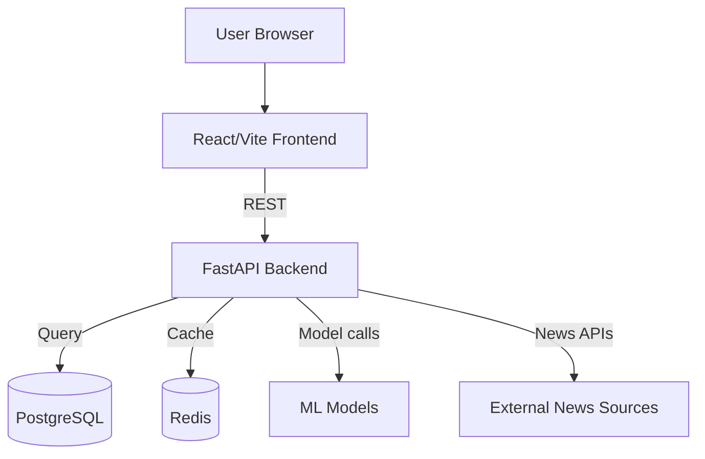
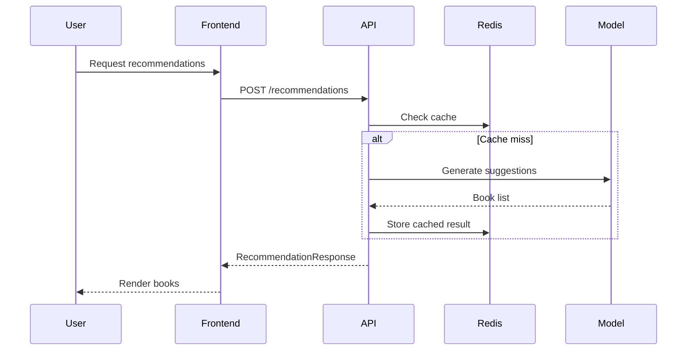

# Architecture

## Component Overview

```mermaid
graph TD
  A[User Browser] --> B[React/Vite Frontend]
  B -->|REST| C[FastAPI Backend]
  C -->|Query| D[(PostgreSQL)]
  C -->|Cache| E[(Redis)]
  C -->|Model calls| F[ML Models]
  C -->|News APIs| G[External News Sources]
```

## Recommendation Flow

```mermaid
sequenceDiagram
  participant U as User
  participant F as Frontend
  participant A as API
  participant R as Redis
  participant M as Model

  U->>F: Request recommendations
  F->>A: POST /recommendations
  A->>R: Check cache
  alt Cache miss
    A->>M: Generate suggestions
    M-->>A: Book list
    A->>R: Store cached result
  end
  A-->>F: RecommendationResponse
  F-->>U: Render books
```

## Deployment
- Docker Compose for local and monitoring stacks
- Kubernetes (via Terraform modules) for production
