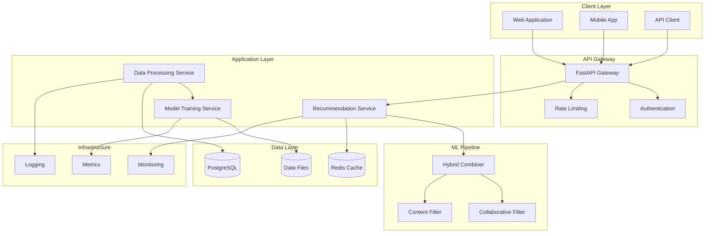
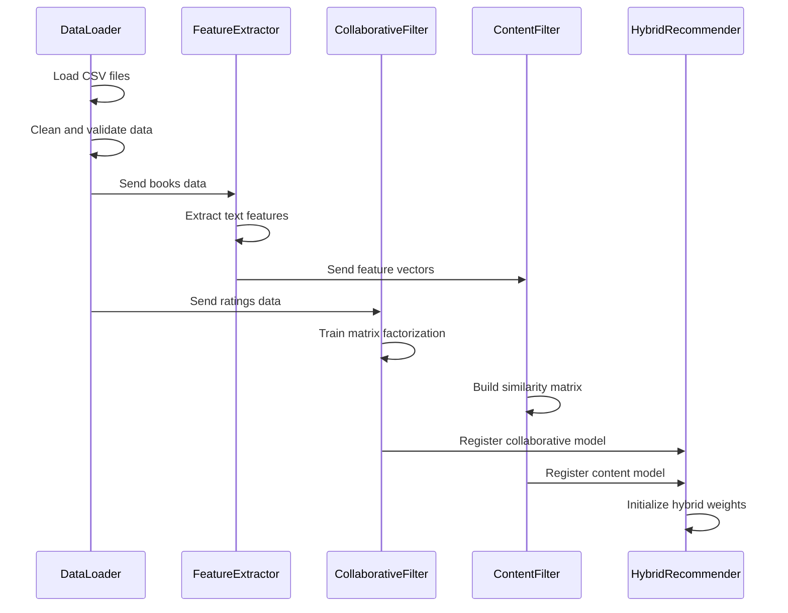
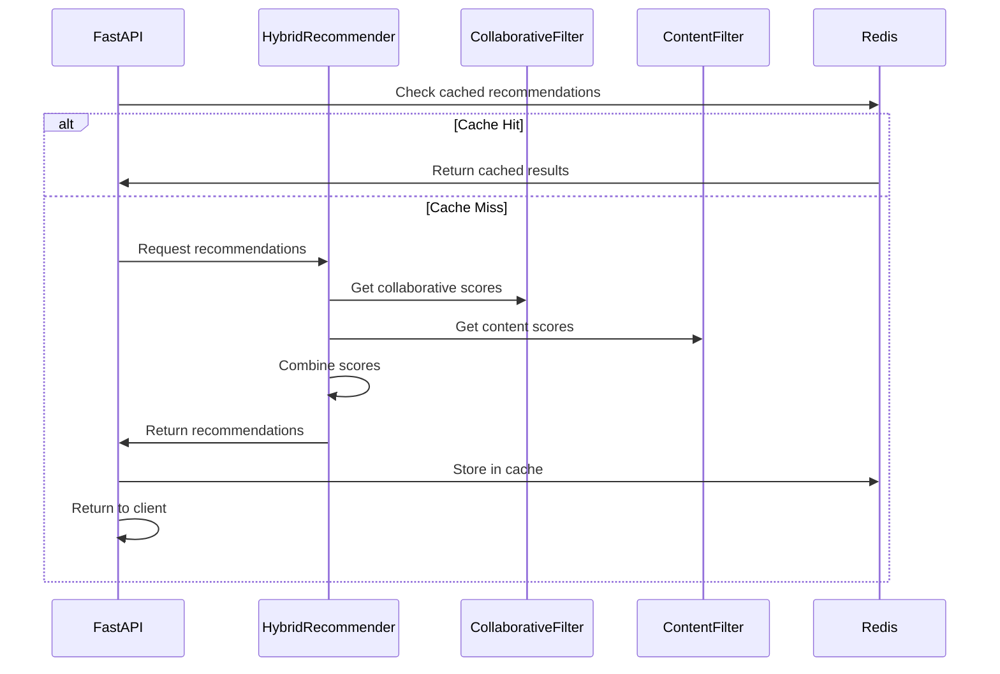
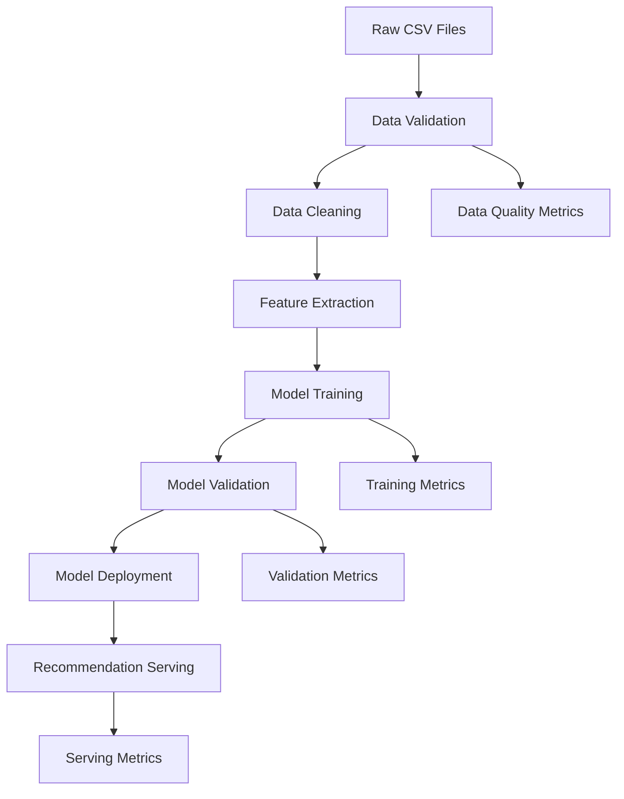

# 🏗️ GoodBooks Recommender Architecture

## Table of Contents

- [Overview](#overview)
- [System Architecture](#system-architecture)
- [Component Design](#component-design)
- [Data Flow](#data-flow)
- [API Design](#api-design)
- [Database Schema](#database-schema)
- [Caching Strategy](#caching-strategy)
- [Security Architecture](#security-architecture)
- [Scalability Considerations](#scalability-considerations)
- [Performance Optimization](#performance-optimization)
- [Monitoring and Observability](#monitoring-and-observability)
- [Deployment Architecture](#deployment-architecture)

## Overview

The GoodBooks Recommender is a hybrid recommendation system that combines collaborative filtering and content-based filtering to provide personalized book recommendations. The system is built using a microservices-inspired architecture with clear separation of concerns.

### Key Design Principles

- **Modularity**: Clear separation between data processing, model training, and API serving
- **Scalability**: Designed to handle growing datasets and user bases
- **Performance**: Optimized for low-latency recommendations
- **Maintainability**: Clean code structure with comprehensive testing
- **Extensibility**: Easy to add new recommendation algorithms

## System Architecture



## Component Design

### 1. API Layer (`src/api/`)

#### FastAPI Application (`main.py`)
- **Purpose**: HTTP API server for handling recommendation requests
- **Responsibilities**:
  - Request validation and parsing
  - Response formatting
  - Error handling
  - API documentation

```python
# Key components
class RecommendationRequest(BaseModel):
    user_id: Optional[int]
    book_title: Optional[str]
    n_recommendations: int = 5

class BookRecommendation(BaseModel):
    book_id: int
    title: str
    authors: str
    score: float
    explanation: str

class RecommendationResponse(BaseModel):
    recommendations: List[BookRecommendation]
    total_count: int
    processing_time: float
```

### 2. Data Layer (`src/data/`)

#### Data Loader (`data_loader.py`)
- **Purpose**: Load and preprocess raw data files
- **Responsibilities**:
  - CSV file reading
  - Data validation
  - Data cleaning
  - Format standardization

```python
class DataLoader:
    def __init__(self, config: Config):
        self.config = config
        self.ratings_data = None
        self.books_data = None
    
    def load_data(self) -> Tuple[pd.DataFrame, pd.DataFrame]:
        """Load ratings and books data"""
        
    def _preprocess_ratings(self, ratings: pd.DataFrame) -> pd.DataFrame:
        """Clean and validate ratings data"""
        
    def _preprocess_books(self, books: pd.DataFrame) -> pd.DataFrame:
        """Clean and validate books data"""
```

#### Feature Extractor (`feature_extractor.py`)
- **Purpose**: Extract features for content-based filtering
- **Responsibilities**:
  - Text preprocessing
  - TF-IDF vectorization
  - Feature engineering
  - Similarity computation

### 3. Models Layer (`src/models/`)

#### Collaborative Filter (`collaborative_filter.py`)
- **Algorithm**: Matrix Factorization (SVD)
- **Features**:
  - User-item interaction modeling
  - Latent factor learning
  - Cold start handling

```python
class CollaborativeFilter:
    def __init__(self, n_factors: int = 50, n_epochs: int = 20):
        self.n_factors = n_factors
        self.n_epochs = n_epochs
        self.model = None
    
    def fit(self, ratings_data: pd.DataFrame):
        """Train collaborative filtering model"""
        
    def predict(self, user_id: int, book_id: int) -> float:
        """Predict rating for user-book pair"""
        
    def get_user_recommendations(self, user_id: int, n_recs: int) -> List[Dict]:
        """Get recommendations for user"""
```

#### Content Filter (`content_filter.py`)
- **Algorithm**: TF-IDF + Cosine Similarity
- **Features**:
  - Book metadata analysis
  - Genre similarity
  - Author similarity

#### Hybrid Recommender (`hybrid_recommender.py`)
- **Strategy**: Weighted combination
- **Features**:
  - Dynamic weight adjustment
  - Fallback mechanisms
  - Explanation generation

```python
class HybridRecommender:
    def __init__(self, content_weight: float = 0.3, collaborative_weight: float = 0.7):
        self.content_weight = content_weight
        self.collaborative_weight = collaborative_weight
        self.content_filter = ContentFilter()
        self.collaborative_filter = CollaborativeFilter()
    
    def fit(self, ratings_data: pd.DataFrame, books_data: pd.DataFrame):
        """Train both recommendation models"""
        
    def get_recommendations(self, user_id: int = None, book_title: str = None, 
                          n_recommendations: int = 5) -> List[Dict]:
        """Get hybrid recommendations"""
```

### 4. Utils Layer (`src/utils/`)

#### Configuration (`config.py`)
- **Purpose**: Centralized configuration management
- **Features**:
  - Environment-based settings
  - Default values
  - Validation

#### Cache Manager (`cache.py`)
- **Purpose**: Redis-based caching
- **Features**:
  - Recommendation caching
  - Model caching
  - TTL management

#### Analytics (`analytics/`)
- **Purpose**: Performance monitoring and metrics
- **Components**:
  - Metrics collector
  - Performance tracker
  - Usage analytics

## Data Flow

### 1. Training Pipeline



### 2. Recommendation Pipeline



### 3. Data Processing Flow



## API Design

### RESTful Endpoints

#### 1. Health Check
```http
GET /health
Response: {
  "status": "healthy",
  "timestamp": "2024-01-15T10:30:00Z",
  "version": "1.0.0",
  "dependencies": {
    "redis": "connected",
    "model": "loaded"
  }
}
```

#### 2. Get Recommendations
```http
POST /recommendations
Content-Type: application/json

{
  "user_id": 123,
  "n_recommendations": 5
}

Response: {
  "recommendations": [
    {
      "book_id": 456,
      "title": "The Great Gatsby",
      "authors": "F. Scott Fitzgerald",
      "score": 0.95,
      "explanation": "Based on your reading history"
    }
  ],
  "total_count": 5,
  "processing_time": 0.15
}
```

#### 3. Similar Books
```http
POST /recommendations
Content-Type: application/json

{
  "book_title": "1984",
  "n_recommendations": 3
}
```

### Error Handling

```python
class APIError(Exception):
    def __init__(self, message: str, status_code: int = 500):
        self.message = message
        self.status_code = status_code

class ValidationError(APIError):
    def __init__(self, message: str):
        super().__init__(message, 400)

class NotFoundError(APIError):
    def __init__(self, message: str):
        super().__init__(message, 404)
```

## Database Schema

### Conceptual Schema

```sql
-- Users table (if user management is added)
CREATE TABLE users (
    user_id SERIAL PRIMARY KEY,
    username VARCHAR(50) UNIQUE NOT NULL,
    email VARCHAR(100) UNIQUE NOT NULL,
    created_at TIMESTAMP DEFAULT CURRENT_TIMESTAMP,
    updated_at TIMESTAMP DEFAULT CURRENT_TIMESTAMP
);

-- Books table
CREATE TABLE books (
    book_id INTEGER PRIMARY KEY,
    title VARCHAR(500) NOT NULL,
    authors VARCHAR(500),
    isbn VARCHAR(20),
    isbn13 VARCHAR(20),
    publication_year INTEGER,
    average_rating DECIMAL(3,2),
    ratings_count INTEGER,
    image_url VARCHAR(500),
    created_at TIMESTAMP DEFAULT CURRENT_TIMESTAMP
);

-- Ratings table
CREATE TABLE ratings (
    rating_id SERIAL PRIMARY KEY,
    user_id INTEGER NOT NULL,
    book_id INTEGER REFERENCES books(book_id),
    rating DECIMAL(2,1) NOT NULL CHECK (rating >= 1 AND rating <= 5),
    created_at TIMESTAMP DEFAULT CURRENT_TIMESTAMP,
    UNIQUE(user_id, book_id)
);

-- Book genres (many-to-many)
CREATE TABLE genres (
    genre_id SERIAL PRIMARY KEY,
    name VARCHAR(100) UNIQUE NOT NULL
);

CREATE TABLE book_genres (
    book_id INTEGER REFERENCES books(book_id),
    genre_id INTEGER REFERENCES genres(genre_id),
    PRIMARY KEY (book_id, genre_id)
);

-- Recommendation cache
CREATE TABLE recommendation_cache (
    cache_key VARCHAR(255) PRIMARY KEY,
    recommendations JSONB NOT NULL,
    created_at TIMESTAMP DEFAULT CURRENT_TIMESTAMP,
    expires_at TIMESTAMP NOT NULL
);

-- Analytics tables
CREATE TABLE recommendation_requests (
    request_id SERIAL PRIMARY KEY,
    user_id INTEGER,
    book_title VARCHAR(500),
    n_recommendations INTEGER,
    processing_time DECIMAL(8,3),
    created_at TIMESTAMP DEFAULT CURRENT_TIMESTAMP
);

CREATE TABLE recommendation_clicks (
    click_id SERIAL PRIMARY KEY,
    request_id INTEGER REFERENCES recommendation_requests(request_id),
    book_id INTEGER REFERENCES books(book_id),
    position INTEGER,
    clicked_at TIMESTAMP DEFAULT CURRENT_TIMESTAMP
);
```

### Indexes for Performance

```sql
-- Ratings table indexes
CREATE INDEX idx_ratings_user_id ON ratings(user_id);
CREATE INDEX idx_ratings_book_id ON ratings(book_id);
CREATE INDEX idx_ratings_rating ON ratings(rating);
CREATE INDEX idx_ratings_created_at ON ratings(created_at);

-- Books table indexes
CREATE INDEX idx_books_title ON books USING gin(to_tsvector('english', title));
CREATE INDEX idx_books_authors ON books USING gin(to_tsvector('english', authors));
CREATE INDEX idx_books_average_rating ON ratings(average_rating);

-- Cache table indexes
CREATE INDEX idx_cache_expires_at ON recommendation_cache(expires_at);

-- Analytics indexes
CREATE INDEX idx_requests_created_at ON recommendation_requests(created_at);
CREATE INDEX idx_requests_user_id ON recommendation_requests(user_id);
```

## Caching Strategy

### Multi-Level Caching

```python
class CacheManager:
    def __init__(self):
        self.redis_client = redis.Redis(host=config.REDIS_HOST, port=config.REDIS_PORT)
        self.local_cache = {}
        self.cache_ttl = {
            'recommendations': 3600,  # 1 hour
            'user_profile': 1800,     # 30 minutes
            'book_features': 86400,   # 24 hours
            'model_predictions': 7200  # 2 hours
        }
    
    def get_recommendations(self, cache_key: str) -> Optional[List[Dict]]:
        # L1: Local cache (fastest)
        if cache_key in self.local_cache:
            return self.local_cache[cache_key]
        
        # L2: Redis cache (fast)
        cached_data = self.redis_client.get(cache_key)
        if cached_data:
            recommendations = json.loads(cached_data)
            self.local_cache[cache_key] = recommendations
            return recommendations
        
        return None
    
    def set_recommendations(self, cache_key: str, recommendations: List[Dict]):
        # Store in both caches
        self.local_cache[cache_key] = recommendations
        self.redis_client.setex(
            cache_key, 
            self.cache_ttl['recommendations'],
            json.dumps(recommendations)
        )
```

### Cache Key Strategy

```python
def generate_cache_key(user_id: int = None, book_title: str = None, 
                      n_recommendations: int = 5) -> str:
    if user_id:
        return f"user_recs:{user_id}:{n_recommendations}"
    elif book_title:
        # Normalize book title for consistent caching
        normalized_title = book_title.lower().strip().replace(' ', '_')
        return f"book_recs:{normalized_title}:{n_recommendations}"
    else:
        return f"popular_recs:{n_recommendations}"
```

## Security Architecture

### Authentication & Authorization

```python
# JWT-based authentication (future enhancement)
class AuthManager:
    def __init__(self, secret_key: str):
        self.secret_key = secret_key
    
    def create_token(self, user_id: int) -> str:
        payload = {
            'user_id': user_id,
            'exp': datetime.utcnow() + timedelta(hours=24)
        }
        return jwt.encode(payload, self.secret_key, algorithm='HS256')
    
    def verify_token(self, token: str) -> Optional[int]:
        try:
            payload = jwt.decode(token, self.secret_key, algorithms=['HS256'])
            return payload['user_id']
        except jwt.ExpiredSignatureError:
            return None
```

### Rate Limiting

```python
from slowapi import Limiter, _rate_limit_exceeded_handler
from slowapi.util import get_remote_address
from slowapi.errors import RateLimitExceeded

limiter = Limiter(key_func=get_remote_address)
app.state.limiter = limiter
app.add_exception_handler(RateLimitExceeded, _rate_limit_exceeded_handler)

@app.post("/recommendations")
@limiter.limit("10/minute")  # 10 requests per minute per IP
async def get_recommendations(request: Request, req: RecommendationRequest):
    # Implementation
    pass
```

### Input Validation

```python
class RecommendationRequest(BaseModel):
    user_id: Optional[int] = Field(None, ge=1, description="User ID must be positive")
    book_title: Optional[str] = Field(None, min_length=1, max_length=500)
    n_recommendations: int = Field(5, ge=1, le=50, description="1-50 recommendations")
    
    @validator('book_title')
    def validate_book_title(cls, v):
        if v is not None:
            # Sanitize input
            v = v.strip()
            if not v:
                raise ValueError('Book title cannot be empty')
        return v
    
    @root_validator
    def validate_request(cls, values):
        user_id = values.get('user_id')
        book_title = values.get('book_title')
        
        if not user_id and not book_title:
            raise ValueError('Either user_id or book_title must be provided')
        
        return values
```

## Scalability Considerations

### Horizontal Scaling

1. **Stateless API Design**
   - No server-side sessions
   - All state in cache/database
   - Load balancer friendly

2. **Database Scaling**
   - Read replicas for queries
   - Partitioning by user_id
   - Connection pooling

3. **Cache Scaling**
   - Redis cluster
   - Consistent hashing
   - Cache warming strategies

### Vertical Scaling

1. **Memory Optimization**
   - Efficient data structures
   - Model compression
   - Garbage collection tuning

2. **CPU Optimization**
   - Vectorized operations
   - Parallel processing
   - Async I/O

### Auto-scaling Configuration

```yaml
# Kubernetes HPA example
apiVersion: autoscaling/v2
kind: HorizontalPodAutoscaler
metadata:
  name: goodbooks-api-hpa
spec:
  scaleTargetRef:
    apiVersion: apps/v1
    kind: Deployment
    name: goodbooks-api
  minReplicas: 2
  maxReplicas: 10
  metrics:
  - type: Resource
    resource:
      name: cpu
      target:
        type: Utilization
        averageUtilization: 70
  - type: Resource
    resource:
      name: memory
      target:
        type: Utilization
        averageUtilization: 80
```

## Performance Optimization

### Model Optimization

1. **Precomputed Similarities**
   ```python
   class OptimizedContentFilter:
       def __init__(self):
           self.similarity_matrix = None
           self.book_index = None
       
       def precompute_similarities(self, books_data: pd.DataFrame):
           # Precompute all book-to-book similarities
           features = self.extract_features(books_data)
           self.similarity_matrix = cosine_similarity(features)
           self.book_index = {book_id: idx for idx, book_id in enumerate(books_data['book_id'])}
   ```

2. **Batch Processing**
   ```python
   def get_batch_recommendations(self, user_ids: List[int]) -> Dict[int, List[Dict]]:
       # Process multiple users in one batch
       user_features = self.get_user_features_batch(user_ids)
       predictions = self.model.predict_batch(user_features)
       return self.format_batch_results(user_ids, predictions)
   ```

### Database Optimization

1. **Query Optimization**
   ```sql
   -- Optimized query for user recommendations
   WITH user_books AS (
       SELECT book_id FROM ratings WHERE user_id = $1
   ),
   similar_users AS (
       SELECT r2.user_id, COUNT(*) as common_books
       FROM ratings r1
       JOIN ratings r2 ON r1.book_id = r2.book_id
       WHERE r1.user_id = $1 AND r2.user_id != $1
       GROUP BY r2.user_id
       HAVING COUNT(*) >= 3
       ORDER BY common_books DESC
       LIMIT 50
   )
   SELECT b.book_id, b.title, AVG(r.rating) as avg_rating
   FROM similar_users su
   JOIN ratings r ON su.user_id = r.user_id
   JOIN books b ON r.book_id = b.book_id
   WHERE r.book_id NOT IN (SELECT book_id FROM user_books)
   GROUP BY b.book_id, b.title
   ORDER BY avg_rating DESC
   LIMIT $2;
   ```

2. **Connection Pooling**
   ```python
   from sqlalchemy.pool import QueuePool
   
   engine = create_engine(
       database_url,
       poolclass=QueuePool,
       pool_size=20,
       max_overflow=30,
       pool_pre_ping=True,
       pool_recycle=3600
   )
   ```

## Monitoring and Observability

### Metrics Collection

```python
from prometheus_client import Counter, Histogram, Gauge

# Define metrics
REQUEST_COUNT = Counter('recommendations_requests_total', 'Total recommendation requests')
REQUEST_DURATION = Histogram('recommendations_duration_seconds', 'Request duration')
ACTIVE_USERS = Gauge('active_users_total', 'Number of active users')
CACHE_HIT_RATE = Gauge('cache_hit_rate', 'Cache hit rate percentage')

class MetricsCollector:
    def __init__(self):
        self.cache_hits = 0
        self.cache_misses = 0
    
    def record_request(self, duration: float):
        REQUEST_COUNT.inc()
        REQUEST_DURATION.observe(duration)
    
    def record_cache_hit(self):
        self.cache_hits += 1
        self.update_cache_hit_rate()
    
    def record_cache_miss(self):
        self.cache_misses += 1
        self.update_cache_hit_rate()
    
    def update_cache_hit_rate(self):
        total = self.cache_hits + self.cache_misses
        if total > 0:
            hit_rate = (self.cache_hits / total) * 100
            CACHE_HIT_RATE.set(hit_rate)
```

### Logging Strategy

```python
import structlog

# Configure structured logging
structlog.configure(
    processors=[
        structlog.stdlib.filter_by_level,
        structlog.stdlib.add_logger_name,
        structlog.stdlib.add_log_level,
        structlog.stdlib.PositionalArgumentsFormatter(),
        structlog.processors.TimeStamper(fmt="iso"),
        structlog.processors.StackInfoRenderer(),
        structlog.processors.format_exc_info,
        structlog.processors.UnicodeDecoder(),
        structlog.processors.JSONRenderer()
    ],
    context_class=dict,
    logger_factory=structlog.stdlib.LoggerFactory(),
    wrapper_class=structlog.stdlib.BoundLogger,
    cache_logger_on_first_use=True,
)

logger = structlog.get_logger()

# Usage in application
def get_recommendations(user_id: int):
    logger.info(
        "recommendation_request_started",
        user_id=user_id,
        timestamp=datetime.utcnow().isoformat()
    )
    
    try:
        recommendations = recommender.get_recommendations(user_id)
        logger.info(
            "recommendation_request_completed",
            user_id=user_id,
            recommendation_count=len(recommendations)
        )
        return recommendations
    except Exception as e:
        logger.error(
            "recommendation_request_failed",
            user_id=user_id,
            error=str(e),
            exc_info=True
        )
        raise
```

### Health Checks

```python
class HealthChecker:
    def __init__(self, recommender, cache_manager, db_connection):
        self.recommender = recommender
        self.cache_manager = cache_manager
        self.db_connection = db_connection
    
    async def check_health(self) -> Dict[str, Any]:
        health_status = {
            "status": "healthy",
            "timestamp": datetime.utcnow().isoformat(),
            "version": "1.0.0",
            "dependencies": {}
        }
        
        # Check model health
        try:
            test_recs = self.recommender.get_recommendations(user_id=1, n_recommendations=1)
            health_status["dependencies"]["model"] = "healthy"
        except Exception as e:
            health_status["dependencies"]["model"] = f"unhealthy: {str(e)}"
            health_status["status"] = "degraded"
        
        # Check cache health
        try:
            self.cache_manager.redis_client.ping()
            health_status["dependencies"]["redis"] = "healthy"
        except Exception as e:
            health_status["dependencies"]["redis"] = f"unhealthy: {str(e)}"
            health_status["status"] = "degraded"
        
        # Check database health
        try:
            self.db_connection.execute("SELECT 1")
            health_status["dependencies"]["database"] = "healthy"
        except Exception as e:
            health_status["dependencies"]["database"] = f"unhealthy: {str(e)}"
            health_status["status"] = "degraded"
        
        return health_status
```

## Deployment Architecture

### Container Strategy

```dockerfile
# Multi-stage build for optimization
FROM python:3.10-slim as builder

WORKDIR /app
COPY requirements.txt .
RUN pip install --no-cache-dir --user -r requirements.txt

FROM python:3.10-slim as runtime

WORKDIR /app
COPY --from=builder /root/.local /root/.local
COPY src/ ./src/
COPY data/ ./data/

# Make sure scripts in .local are usable
ENV PATH=/root/.local/bin:$PATH

# Create non-root user
RUN useradd --create-home --shell /bin/bash app
USER app

EXPOSE 8000
CMD ["python", "-m", "uvicorn", "src.api.main:app", "--host", "0.0.0.0", "--port", "8000"]
```

### Kubernetes Deployment

```yaml
apiVersion: apps/v1
kind: Deployment
metadata:
  name: goodbooks-api
  labels:
    app: goodbooks-api
spec:
  replicas: 3
  selector:
    matchLabels:
      app: goodbooks-api
  template:
    metadata:
      labels:
        app: goodbooks-api
    spec:
      containers:
      - name: api
        image: goodbooks-api:latest
        ports:
        - containerPort: 8000
        env:
        - name: REDIS_HOST
          value: "redis-service"
        - name: DATABASE_URL
          valueFrom:
            secretKeyRef:
              name: db-secret
              key: url
        resources:
          requests:
            memory: "256Mi"
            cpu: "250m"
          limits:
            memory: "512Mi"
            cpu: "500m"
        livenessProbe:
          httpGet:
            path: /health
            port: 8000
          initialDelaySeconds: 30
          periodSeconds: 10
        readinessProbe:
          httpGet:
            path: /health
            port: 8000
          initialDelaySeconds: 5
          periodSeconds: 5
```

This architecture provides a solid foundation for a scalable, maintainable, and performant recommendation system that can grow with user demands while maintaining high availability and reliability.