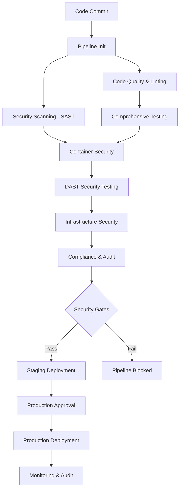

# Production CI/CD Pipeline Documentation

## Overview

This document describes the comprehensive DevSecOps CI/CD pipeline for the GoodBooks Recommender system. The pipeline implements security-first practices with automated testing, vulnerability scanning, compliance checking, and multiple deployment strategies.

## Architecture

### Pipeline Components



### Security Gates

The pipeline implements multiple security gates that must pass before deployment:

1. **SAST Gate**: No critical vulnerabilities in static analysis
2. **Container Gate**: No critical CVEs in container images
3. **DAST Gate**: No high-risk vulnerabilities in running application
4. **Compliance Gate**: OWASP Top 10 and GDPR compliance verified

## Pipeline Stages

### 1. Pipeline Initialization
- Environment detection and configuration
- Version generation and tagging
- Audit logging setup
- Resource allocation

### 2. Code Quality & Linting
- **Python**: Black, isort, pylint, flake8, mypy
- **JavaScript**: ESLint with security plugins
- **Type checking**: mypy with strict configuration
- **Code complexity analysis**: Cyclomatic complexity checks

### 3. Comprehensive Testing
- **Unit Tests**: pytest with 90% coverage requirement
- **Integration Tests**: API and database integration
- **Performance Tests**: Benchmark testing with pytest-benchmark
- **Security Tests**: Custom security validation

### 4. SAST Security Scanning
- **Bandit**: Python-specific security analysis
- **Safety**: Dependency vulnerability scanning
- **Semgrep**: Multi-language pattern-based analysis
- **CodeQL**: GitHub's semantic code analysis
- **ESLint Security**: JavaScript security linting

### 5. Container Security
- **Trivy**: Comprehensive vulnerability scanning
- **Dockerfile analysis**: Security best practices validation
- **Image signing**: Supply chain security
- **Registry security**: Secure image storage

### 6. DAST Security Testing
- **OWASP ZAP**: Dynamic application security testing
- **Custom security tests**: Application-specific security validation
- **API security testing**: Authentication and authorization testing
- **Input validation testing**: XSS, SQL injection, CSRF testing

### 7. Infrastructure Security
- **Terraform security**: tfsec and Checkov analysis
- **Container configuration**: Docker Compose security scanning
- **Cloud security**: AWS security best practices validation

### 8. Compliance & Audit
- **OWASP Top 10**: Comprehensive coverage analysis
- **GDPR compliance**: Data protection validation
- **Security controls**: Control effectiveness assessment
- **Audit trail**: Complete pipeline activity logging

## Deployment Strategies

### Blue-Green Deployment
```yaml
Strategy: Blue-Green
Use Case: Zero-downtime production deployments
Process:
  1. Deploy to green environment
  2. Run smoke tests
  3. Switch traffic to green
  4. Monitor for 5 minutes
  5. Cleanup blue environment
Rollback: Instant traffic switch back to blue
```

### Canary Deployment
```yaml
Strategy: Canary
Use Case: Risk-minimized gradual rollouts
Process:
  1. Deploy canary version
  2. Route 10% traffic to canary
  3. Monitor performance and errors
  4. Gradually increase traffic (10% → 25% → 50%)
  5. Complete rollout if metrics are healthy
Rollback: Remove canary and route traffic back
```

### Rolling Deployment
```yaml
Strategy: Rolling
Use Case: Resource-efficient updates
Process:
  1. Update replicas in batches (1/3 at a time)
  2. Wait for each batch to be ready
  3. Run health checks per batch
  4. Continue to next batch
Rollback: Kubernetes rollout undo
```

## Security Configuration

### SAST Configuration
```yaml
bandit:
  severity_threshold: medium
  confidence_threshold: medium
  excluded_paths:
    - tests/
    - venv/

safety:
  ignore_vulns: []
  audit_bare_urls: true

semgrep:
  rules: auto
  severity: ERROR,WARNING
  exclude_rules:
    - generic.secrets.security.detected-private-key
```

### DAST Configuration
```yaml
owasp_zap:
  baseline_scan: true
  active_scan: false
  api_scan: true
  authentication:
    type: form-based
    login_url: /auth/login
  context:
    include_paths:
      - /api/.*
      - /auth/.*
    exclude_paths:
      - /health
      - /docs
```

### Container Security
```yaml
trivy:
  severity_threshold: HIGH,CRITICAL
  ignore_unfixed: false
  security_checks: vuln,config,secret
  skip_files:
    - "**/.git/**"
    - "**/node_modules/**"
```

## Monitoring & Alerting

### Key Metrics
- **Pipeline Success Rate**: Target >95%
- **Security Gate Pass Rate**: Target >90%
- **Deployment Frequency**: Daily deployments
- **Lead Time**: <2 hours from commit to production
- **MTTR**: <30 minutes for critical issues

### Alerting Rules
```yaml
alerts:
  - name: PipelineFailure
    condition: pipeline_status == "failed"
    severity: warning
    
  - name: SecurityGateFailure
    condition: security_gate_status == "failed"
    severity: critical
    
  - name: DeploymentFailure
    condition: deployment_status == "failed"
    severity: critical
    
  - name: ComplianceViolation
    condition: compliance_score < 80
    severity: warning
```

## Infrastructure as Code

### Terraform Modules
```
terraform/
├── main.tf                 # Root configuration
├── variables.tf           # Variable definitions
├── outputs.tf            # Output values
└── modules/
    ├── vpc/              # Network infrastructure
    ├── eks/              # Kubernetes cluster
    ├── github-runners/   # CI/CD runners
    ├── vault/           # Secrets management
    ├── monitoring/      # Observability stack
    └── security/        # Security tools
```

### Runner Configuration
- **Instance Type**: t3.large (CIS-hardened)
- **Auto Scaling**: 1-10 instances based on load
- **Security**: Non-root user, encrypted storage
- **Monitoring**: CloudWatch logs and metrics
- **Compliance**: CIS Level 1 hardening

## Secrets Management

### HashiCorp Vault Integration
```yaml
vault_config:
  address: https://vault.company.com
  auth_method: kubernetes
  policies:
    - goodbooks-ci-policy
    - goodbooks-production-policy
  
secrets:
  database_url: vault:secret/data/goodbooks/database#url
  redis_url: vault:secret/data/goodbooks/redis#url
  jwt_secret: vault:secret/data/goodbooks/auth#jwt_secret
  github_token: vault:secret/data/goodbooks/github#token
```

### GitHub Secrets
```yaml
secrets:
  VAULT_ADDR: "https://vault.company.com"
  VAULT_TOKEN: "generated-service-token"
  DOCKER_REGISTRY: "ghcr.io"
  SONARQUBE_TOKEN: "security-token"
  SLACK_WEBHOOK: "monitoring-webhook"
```

## Compliance Framework

### OWASP Top 10 2021 Coverage

| Category | Coverage | Testing Method |
|----------|----------|----------------|
| A01: Broken Access Control | ✅ | RBAC testing, DAST |
| A02: Cryptographic Failures | ✅ | TLS validation, encryption audit |
| A03: Injection | ✅ | SAST, DAST, parameterized queries |
| A04: Insecure Design | ✅ | Threat modeling, security review |
| A05: Security Misconfiguration | ✅ | Container scanning, IaC analysis |
| A06: Vulnerable Components | ✅ | Dependency scanning, SCA |
| A07: ID & Auth Failures | ✅ | Authentication testing, JWT validation |
| A08: Data Integrity Failures | ✅ | Supply chain security, signing |
| A09: Logging & Monitoring Failures | ✅ | Comprehensive logging, SIEM |
| A10: Server-Side Request Forgery | ✅ | DAST testing, input validation |

### GDPR Compliance Controls

| Requirement | Implementation | Validation |
|-------------|----------------|------------|
| Data Minimization | Privacy-by-design architecture | Data flow analysis |
| Consent Management | Explicit user consent system | Consent audit trail |
| Data Encryption | AES-256 encryption at rest/transit | Encryption verification |
| Right to be Forgotten | Data deletion endpoints | Deletion verification |
| Breach Detection | Real-time monitoring and alerting | Incident response testing |

## Usage Instructions

### Running the Pipeline

1. **Automatic Trigger**:
   ```bash
   git push origin main  # Triggers production pipeline
   git push origin develop  # Triggers staging pipeline
   ```

2. **Manual Trigger**:
   ```bash
   # Via GitHub Actions UI
   # Select workflow -> Run workflow -> Choose environment
   ```

3. **API Trigger**:
   ```bash
   curl -X POST \
     -H "Authorization: token $GITHUB_TOKEN" \
     -H "Accept: application/vnd.github.v3+json" \
     https://api.github.com/repos/OWNER/REPO/actions/workflows/production-cicd.yml/dispatches \
     -d '{"ref":"main","inputs":{"environment":"production","deployment_strategy":"blue-green"}}'
   ```

### Deployment Commands

1. **Blue-Green Deployment**:
   ```bash
   python scripts/deploy_pipeline.py \
     --strategy blue-green \
     --image-tag v1.2.3 \
     --environment production \
     --config config/deployment.yml
   ```

2. **Canary Deployment**:
   ```bash
   python scripts/deploy_pipeline.py \
     --strategy canary \
     --image-tag v1.2.3 \
     --environment production \
     --config config/deployment.yml \
     --canary-traffic 10
   ```

### Security Scanning

1. **Local Security Scan**:
   ```bash
   python scripts/security_scan.py --base-url http://localhost:8000
   ```

2. **Generate Security Report**:
   ```bash
   python scripts/generate_pipeline_config.py
   ```

## Troubleshooting

### Common Issues

1. **Security Gate Failures**:
   ```bash
   # Check security reports
   cat reports/security-summary.json
   
   # View detailed SAST results
   cat reports/bandit-report.json
   
   # Check container vulnerabilities
   cat reports/trivy/trivy-report.json
   ```

2. **Deployment Failures**:
   ```bash
   # Check deployment logs
   kubectl logs -f deployment/goodbooks -n production
   
   # Check rollout status
   kubectl rollout status deployment/goodbooks -n production
   
   # Manual rollback
   kubectl rollout undo deployment/goodbooks -n production
   ```

3. **Pipeline Performance Issues**:
   ```bash
   # Check runner capacity
   kubectl get nodes -l role=ci-runner
   
   # Scale runners
   kubectl scale deployment github-runner --replicas=5
   ```

### Emergency Procedures

1. **Security Incident**:
   - Immediately stop pipeline execution
   - Isolate affected environments
   - Activate incident response team
   - Generate security audit report

2. **Deployment Rollback**:
   - Automatic rollback on failed health checks
   - Manual rollback via kubectl or UI
   - Traffic routing rollback for blue-green

3. **Pipeline Recovery**:
   - Check runner health and capacity
   - Verify secrets and credentials
   - Restart failed pipeline stages
   - Escalate to DevOps team if needed

## Performance Optimization

### Pipeline Acceleration
- **Parallel Execution**: Independent stages run concurrently
- **Caching**: Docker layer caching, dependency caching
- **Resource Scaling**: Auto-scaling runners based on load
- **Selective Testing**: Run only changed code tests in PR builds

### Resource Management
- **Ephemeral Runners**: Terminate after use to ensure clean state
- **Resource Limits**: CPU and memory limits for containers
- **Spot Instances**: Cost optimization for non-critical workloads
- **Regional Distribution**: Multi-region deployment for latency

## Maintenance

### Regular Tasks
- **Weekly**: Security signature updates
- **Monthly**: Dependency updates and vulnerability patching
- **Quarterly**: Compliance audits and security reviews
- **Annually**: Disaster recovery testing and security assessments

### Updates and Upgrades
- **Tool Updates**: Automated security tool version updates
- **Infrastructure Updates**: Terraform plan review and apply
- **Policy Updates**: Security policy and compliance requirement updates
- **Training**: Team training on new security practices

## Support and Contact

### Team Contacts
- **DevOps Team**: devops@company.com
- **Security Team**: security@company.com
- **Platform Team**: platform@company.com

### Escalation Matrix
1. **Level 1**: On-call DevOps engineer
2. **Level 2**: Senior DevOps/Security lead
3. **Level 3**: Engineering management
4. **Level 4**: CTO/CISO

### Documentation Links
- [Security Policies](docs/SECURITY_GUIDE.md)
- [Deployment Guide](docs/DEPLOYMENT_GUIDE.md)
- [Troubleshooting Guide](docs/TROUBLESHOOTING.md)
- [API Reference](docs/API_REFERENCE.md)
