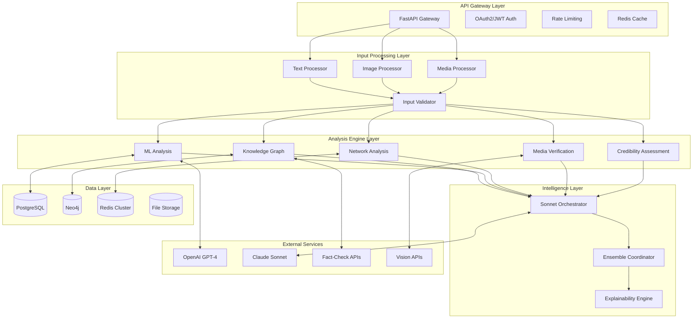

# 🎯 False News Detection System - Modular Implementation Plan

## 🚀 Executive Summary

This document provides a complete modular system plan for implementing a production-grade false news detection system. The system leverages the existing GoodBooksRecommender infrastructure while providing advanced multimodal analysis, evidence-based fact-checking, and explainable AI results.

## 🏗️ Modular Architecture Overview



## 📦 Module Specifications

### Module 1: Input Processing (`src/fakenews/input/`)
**Responsibility**: Multimodal input handling and standardization

**Components**:
- **TextProcessor**: NLP preprocessing, language detection, entity extraction
- **ImageProcessor**: Image validation, metadata extraction, basic analysis
- **MediaProcessor**: Audio/video processing, ASR transcription
- **InputValidator**: Security validation, content hashing, format verification

**Key Features**:
- Support for text, images, video/audio files
- Automatic Speech Recognition using Whisper
- EXIF/metadata extraction and forensics
- Input sanitization and malware scanning
- Content deduplication using hashing

**Dependencies**: `spacy`, `PIL`, `ffmpeg`, `whisper`, `python-magic`

**API Endpoints**:
- `POST /input/validate` - Validate input before processing
- `POST /input/process` - Process and standardize input
- `GET /input/{hash}` - Retrieve processed input by hash

**Testing Strategy**:
- Unit tests for each processor component
- Integration tests with malicious inputs
- Performance tests with large files
- Security tests for input validation

---

### Module 2: Knowledge Graph & Timeline (`src/fakenews/knowledge/`)
**Responsibility**: Fact verification and temporal reasoning

**Components**:
- **KnowledgeGraph**: Neo4j operations, entity relationships
- **FactChecker**: External API integration (Snopes, FactCheck.org)
- **TimelineVerifier**: Temporal consistency analysis
- **EntityExtractor**: Named entity recognition and linking
- **ExternalAPIs**: Unified interface to fact-checking services

**Key Features**:
- Real-time fact verification against multiple sources
- Timeline consistency analysis for event claims
- Entity relationship mapping and verification
- Historical context analysis
- Confidence scoring for fact claims

**Dependencies**: `neo4j`, `spacy`, `requests`, `dateparser`, `fuzzywuzzy`

**Data Model**:
```python
# Neo4j Graph Schema
class Entity(Node):
    name = StringProperty(unique_index=True)
    type = StringProperty()  # PERSON, ORGANIZATION, EVENT, etc.
    
class Fact(Node):
    claim = StringProperty()
    verdict = StringProperty()  # TRUE, FALSE, MIXED, UNPROVEN
    confidence = FloatProperty()
    source = StringProperty()
    timestamp = DateTimeProperty()

class SUPPORTS(Relationship):
    confidence = FloatProperty()
    source = StringProperty()

class CONTRADICTS(Relationship):
    confidence = FloatProperty()
    source = StringProperty()
```

**API Endpoints**:
- `POST /knowledge/fact-check` - Verify specific claims
- `POST /knowledge/timeline-check` - Verify temporal consistency
- `GET /knowledge/entities/{entity}` - Get entity information
- `POST /knowledge/relationships` - Query entity relationships

---

### Module 3: Network Analysis (`src/fakenews/network/`)
**Responsibility**: Social network propagation and anomaly detection

**Components**:
- **PropagationAnalyzer**: Content spread pattern analysis
- **DiffusionNetwork**: Network topology modeling
- **AnomalyDetector**: Suspicious pattern identification
- **BotDetector**: Automated account identification
- **InfluenceTracker**: Key influencer and source tracking

**Key Features**:
- Real-time propagation tracking across platforms
- Bot network detection using behavioral analysis
- Viral content pattern analysis
- Influence mapping and cascade detection
- Coordinated inauthentic behavior detection

**Dependencies**: `networkx`, `pandas`, `scikit-learn`, `tweepy`, `facebook-sdk`

**Data Model**:
```python
class PropagationNode(BaseModel):
    user_id: str
    platform: str
    timestamp: datetime
    content_hash: str
    engagement_metrics: Dict[str, int]
    user_features: Dict[str, float]

class PropagationEdge(BaseModel):
    source_node: str
    target_node: str
    interaction_type: str  # SHARE, LIKE, COMMENT, MENTION
    timestamp: datetime
    strength: float
```

**API Endpoints**:
- `POST /network/analyze-propagation` - Analyze content spread
- `POST /network/detect-bots` - Identify bot accounts
- `GET /network/influence-map/{content}` - Get influence network
- `POST /network/anomaly-detection` - Detect suspicious patterns

---

### Module 4: ML & Linguistic Analysis (`src/fakenews/ml/`)
**Responsibility**: Advanced AI models for content analysis

**Components**:
- **GPT4Analyzer**: Fine-tuned GPT-4 integration
- **EnsembleModels**: Traditional ML model ensemble
- **TransformerFeatures**: BERT/RoBERTa feature extraction
- **LinguisticAnalyzer**: Style and pattern analysis
- **SentimentAnalyzer**: Emotional manipulation detection

**Key Features**:
- Multi-model ensemble predictions with uncertainty quantification
- Linguistic style analysis for authorship attribution
- Emotional manipulation and bias detection
- Context-aware classification with explanation
- Adversarial robustness testing

**Dependencies**: `transformers`, `torch`, `openai`, `scikit-learn`, `xgboost`

**Model Architecture**:
```python
class EnsembleDetector:
    def __init__(self):
        self.models = {
            'gpt4': GPT4Classifier(),
            'bert': BERTClassifier(),
            'roberta': RoBERTaClassifier(),
            'traditional': XGBoostClassifier(),
            'linguistic': LinguisticClassifier()
        }
        self.meta_model = LogisticRegression()
    
    async def predict(self, text: str) -> Prediction:
        # Get predictions from all models
        predictions = {}
        for name, model in self.models.items():
            predictions[name] = await model.predict(text)
        
        # Meta-learning ensemble
        final_prediction = self.meta_model.predict(predictions)
        
        return Prediction(
            verdict=final_prediction.verdict,
            confidence=final_prediction.confidence,
            model_scores=predictions,
            explanation=self._generate_explanation(predictions)
        )
```

**API Endpoints**:
- `POST /ml/classify` - Classify content authenticity
- `POST /ml/linguistic-analysis` - Analyze linguistic patterns
- `POST /ml/sentiment-analysis` - Detect emotional manipulation
- `GET /ml/model-performance` - Get model performance metrics

---

### Module 5: Media Verification (`src/fakenews/media/`)
**Responsibility**: Deepfake and media authenticity verification

**Components**:
- **DeepfakeDetector**: GAN artifact detection using CNN models
- **MetadataVerifier**: EXIF and technical metadata analysis
- **ReverseSearch**: Reverse image/video search integration
- **AuthenticityChecker**: Digital signature verification
- **ForensicsAnalyzer**: Advanced digital forensics techniques

**Key Features**:
- Real-time deepfake detection with multiple algorithms
- Metadata forensics and tampering detection
- Reverse search across multiple databases
- Digital watermark and signature verification
- Error Level Analysis (ELA) for manipulation detection

**Dependencies**: `opencv-python`, `tensorflow`, `torch`, `exifread`, `pillow`

**Detection Pipeline**:
```python
class MediaAuthenticityPipeline:
    def __init__(self):
        self.deepfake_models = [
            FaceSwapDetector(),
            GANDetector(),
            BlendingDetector()
        ]
        self.forensics_tools = [
            ELAAnalyzer(),
            NoiseAnalyzer(),
            CompressionAnalyzer()
        ]
    
    async def analyze(self, media: ProcessedMedia) -> MediaAnalysis:
        results = {}
        
        # Deepfake detection
        if media.media_type == 'image':
            for detector in self.deepfake_models:
                results[detector.name] = await detector.analyze(media)
        
        # Forensics analysis
        for tool in self.forensics_tools:
            results[tool.name] = await tool.analyze(media)
        
        # Reverse search
        reverse_results = await self.reverse_search(media)
        
        return MediaAnalysis(
            authenticity_score=self._calculate_score(results),
            deepfake_probability=results.get('deepfake', 0.0),
            tampering_evidence=self._detect_tampering(results),
            reverse_search_matches=reverse_results,
            metadata_analysis=results.get('metadata', {}),
            confidence=self._calculate_confidence(results)
        )
```

**API Endpoints**:
- `POST /media/analyze` - Comprehensive media analysis
- `POST /media/deepfake-detect` - Specific deepfake detection
- `POST /media/reverse-search` - Reverse image/video search
- `POST /media/metadata-analysis` - Detailed metadata analysis

---

### Module 6: Credibility Assessment (`src/fakenews/credibility/`)
**Responsibility**: Source reliability and historical accuracy tracking

**Components**:
- **SourceScorer**: Domain and source reliability scoring
- **BiasDetector**: Political and ideological bias analysis
- **HistoryTracker**: Historical accuracy tracking
- **ReputationManager**: Dynamic reputation scoring
- **PeerValidator**: Cross-source validation

**Key Features**:
- Dynamic source reputation scoring with decay
- Multi-dimensional bias detection (political, commercial, cultural)
- Historical accuracy tracking with time-weighted scoring
- Peer validation networks and consensus building
- Trust propagation through source networks

**Dependencies**: `scikit-learn`, `pandas`, `numpy`, `nltk`, `textblob`

**Credibility Model**:
```python
class SourceCredibility(BaseModel):
    domain: str
    overall_score: float  # 0.0 to 1.0
    accuracy_score: float
    bias_score: float  # -1.0 (left) to 1.0 (right)
    transparency_score: float
    
    # Historical metrics
    total_articles: int
    verified_accurate: int
    verified_false: int
    mixed_rating: int
    
    # Time-based metrics
    recent_performance: float  # Last 30 days
    long_term_trend: float
    
    # Peer validation
    peer_ratings: List[float]
    expert_ratings: List[float]
    
    last_updated: datetime
    
    def calculate_weighted_score(self) -> float:
        """Calculate time-weighted credibility score."""
        weights = {
            'accuracy': 0.4,
            'bias': 0.2,
            'transparency': 0.2,
            'recent_performance': 0.1,
            'peer_consensus': 0.1
        }
        
        return sum(
            getattr(self, metric) * weight
            for metric, weight in weights.items()
        )
```

**API Endpoints**:
- `GET /credibility/source/{domain}` - Get source credibility
- `POST /credibility/analyze-bias` - Analyze content bias
- `POST /credibility/update-rating` - Update source rating
- `GET /credibility/rankings` - Get credibility rankings

---

### Module 7: Explainability (`src/fakenews/explainability/`)
**Responsibility**: Human-interpretable explanations and evidence compilation

**Components**:
- **ExplanationGenerator**: Natural language explanation generation
- **EvidenceCompiler**: Supporting evidence aggregation
- **VisualizationEngine**: Interactive explanation visualizations
- **ConfidenceCalibrator**: Uncertainty quantification
- **ReportGenerator**: Comprehensive analysis reports

**Key Features**:
- Multi-level explanations (summary, detailed, technical)
- Interactive evidence presentation with source links
- Confidence intervals and uncertainty quantification
- Visual evidence timelines and network graphs
- Customizable explanation depth and format

**Dependencies**: `jinja2`, `plotly`, `matplotlib`, `wordcloud`, `nltk`

**Explanation Framework**:
```python
class ExplanationFramework:
    def __init__(self):
        self.templates = {
            'summary': SummaryTemplate(),
            'detailed': DetailedTemplate(),
            'technical': TechnicalTemplate(),
            'visual': VisualTemplate()
        }
    
    async def generate_explanation(
        self, 
        analysis_results: Dict[str, Any],
        explanation_level: str = 'detailed'
    ) -> Explanation:
        
        # Compile evidence
        evidence = self._compile_evidence(analysis_results)
        
        # Generate natural language explanation
        text_explanation = await self._generate_text_explanation(
            analysis_results, evidence, explanation_level
        )
        
        # Create visualizations
        visualizations = await self._generate_visualizations(
            analysis_results, evidence
        )
        
        # Calculate confidence intervals
        confidence_intervals = self._calculate_confidence_intervals(
            analysis_results
        )
        
        return Explanation(
            summary=text_explanation['summary'],
            detailed_analysis=text_explanation['detailed'],
            key_factors=self._extract_key_factors(analysis_results),
            methodology=self._describe_methodology(analysis_results),
            limitations=self._identify_limitations(analysis_results),
            evidence=evidence,
            visualizations=visualizations,
            confidence_intervals=confidence_intervals,
            interactive_elements=self._create_interactive_elements(evidence)
        )
    
    def _compile_evidence(self, results: Dict[str, Any]) -> List[Evidence]:
        """Compile and rank evidence from all analysis modules."""
        evidence_items = []
        
        # Knowledge graph evidence
        if 'knowledge_graph' in results:
            kg_evidence = self._extract_kg_evidence(results['knowledge_graph'])
            evidence_items.extend(kg_evidence)
        
        # Source credibility evidence
        if 'credibility' in results:
            cred_evidence = self._extract_credibility_evidence(results['credibility'])
            evidence_items.extend(cred_evidence)
        
        # Network analysis evidence
        if 'network' in results:
            network_evidence = self._extract_network_evidence(results['network'])
            evidence_items.extend(network_evidence)
        
        # Sort by reliability and relevance
        evidence_items.sort(
            key=lambda x: (x.reliability_score, x.relevance_score),
            reverse=True
        )
        
        return evidence_items[:20]  # Top 20 pieces of evidence
```

**API Endpoints**:
- `POST /explain/generate` - Generate comprehensive explanation
- `POST /explain/summary` - Generate summary explanation
- `GET /explain/visualize/{request_id}` - Get explanation visualizations
- `POST /explain/customize` - Generate custom explanation format

---

### Module 8: Orchestration (`src/fakenews/orchestration/`)
**Responsibility**: Self-refinement and ensemble coordination using Claude Sonnet

**Components**:
- **SonnetOrchestrator**: Claude Sonnet 4 integration for self-refinement
- **EnsembleCoordinator**: Model ensemble management
- **ThresholdTuner**: Dynamic threshold optimization
- **FeedbackProcessor**: User feedback integration
- **ModelUpdater**: Continuous learning and model updates

**Key Features**:
- Iterative self-refinement using Claude Sonnet 4
- Dynamic threshold optimization based on performance
- Ensemble weight optimization using meta-learning
- Continuous learning from user feedback
- A/B testing for model improvements

**Dependencies**: `anthropic`, `optuna`, `mlflow`, `scikit-optimize`

**Orchestration Framework**:
```python
class SonnetOrchestrator:
    def __init__(self):
        self.client = anthropic.Client()
        self.refinement_history = []
        self.performance_tracker = PerformanceTracker()
    
    async def orchestrate_analysis(
        self, 
        request: DetectionRequest,
        initial_results: Dict[str, Any]
    ) -> RefinedAnalysis:
        
        # Initial ensemble results
        ensemble_result = await self._run_ensemble_analysis(request, initial_results)
        
        # Self-refinement using Claude Sonnet
        refinement_rounds = 0
        max_rounds = 3
        
        while refinement_rounds < max_rounds:
            # Ask Sonnet to critique and refine
            critique = await self._get_sonnet_critique(
                request, ensemble_result, self.refinement_history
            )
            
            if critique.confidence_score > 0.9:
                break  # Sonnet is confident in the result
            
            # Apply refinements
            refined_result = await self._apply_refinements(
                ensemble_result, critique.suggestions
            )
            
            # Update ensemble weights based on refinement
            await self._update_ensemble_weights(
                ensemble_result, refined_result, critique
            )
            
            ensemble_result = refined_result
            refinement_rounds += 1
            
            self.refinement_history.append({
                'round': refinement_rounds,
                'critique': critique,
                'refinements': critique.suggestions,
                'performance_improvement': self._calculate_improvement(
                    ensemble_result, refined_result
                )
            })
        
        # Final threshold tuning
        final_result = await self._apply_dynamic_thresholds(ensemble_result)
        
        return RefinedAnalysis(
            final_verdict=final_result.verdict,
            confidence_score=final_result.confidence,
            refinement_rounds=refinement_rounds,
            sonnet_confidence=critique.confidence_score,
            ensemble_weights=self._get_current_weights(),
            refinement_history=self.refinement_history[-5:]  # Last 5 rounds
        )
    
    async def _get_sonnet_critique(
        self, 
        request: DetectionRequest,
        current_result: AnalysisResult,
        history: List[Dict]
    ) -> Critique:
        
        prompt = f"""
        Analyze this fake news detection result and provide refinement suggestions:
        
        Original Content: {request.text_content[:1000]}...
        Current Analysis:
        - Verdict: {current_result.verdict}
        - Confidence: {current_result.confidence_score}
        - Key Evidence: {current_result.top_evidence}
        
        Previous Refinement History: {history[-2:] if history else 'None'}
        
        Please critique this analysis and suggest improvements considering:
        1. Evidence quality and reliability
        2. Logical consistency of the verdict
        3. Confidence calibration accuracy
        4. Missing analysis angles
        5. Potential biases or errors
        
        Provide specific, actionable refinement suggestions.
        """
        
        response = await self.client.messages.create(
            model="claude-3-sonnet-20240229",
            max_tokens=2000,
            messages=[{"role": "user", "content": prompt}]
        )
        
        return self._parse_sonnet_response(response.content[0].text)
```

**API Endpoints**:
- `POST /orchestrate/analyze` - Full orchestrated analysis
- `POST /orchestrate/refine` - Refine existing analysis
- `GET /orchestrate/performance` - Get orchestration performance
- `POST /orchestrate/feedback` - Submit user feedback

---

### Module 9: API Integration (`src/fakenews/api/`)
**Responsibility**: RESTful and real-time API interfaces

**Components**:
- **DetectionEndpoints**: Core detection API endpoints
- **BatchProcessor**: Bulk analysis endpoints
- **WebSocketHandler**: Real-time analysis streaming
- **WebhookManager**: External integration webhooks
- **AdminEndpoints**: Administrative and monitoring endpoints

**Key Features**:
- RESTful JSON API with comprehensive OpenAPI documentation
- Real-time WebSocket streaming for live analysis updates
- Batch processing capabilities for bulk analysis
- Webhook integration for external systems
- Administrative interfaces for system management

**Complete API Specification**:
```python
# src/fakenews/api/main.py
from fastapi import FastAPI, WebSocket, BackgroundTasks
from fastapi.middleware.cors import CORSMiddleware
from .detection import router as detection_router
from .batch import router as batch_router
from .admin import router as admin_router
from .websocket import websocket_manager

app = FastAPI(
    title="False News Detection API",
    description="Production-grade false news detection with multimodal analysis",
    version="1.0.0",
    docs_url="/docs",
    redoc_url="/redoc"
)

# Include routers
app.include_router(detection_router, prefix="/api/v1/detect", tags=["Detection"])
app.include_router(batch_router, prefix="/api/v1/batch", tags=["Batch Processing"])
app.include_router(admin_router, prefix="/api/v1/admin", tags=["Administration"])

@app.websocket("/ws/analysis/{request_id}")
async def websocket_analysis_updates(websocket: WebSocket, request_id: str):
    """WebSocket endpoint for real-time analysis updates."""
    await websocket_manager.connect(websocket, request_id)
    try:
        while True:
            # Keep connection alive and send updates
            update = await websocket_manager.get_update(request_id)
            if update:
                await websocket.send_json(update)
            await asyncio.sleep(1)
    except WebSocketDisconnect:
        websocket_manager.disconnect(websocket, request_id)

@app.post("/api/v1/webhooks/analysis-complete")
async def analysis_complete_webhook(webhook_data: WebhookData):
    """Webhook for notifying external systems of completed analysis."""
    await webhook_manager.process_webhook(webhook_data)
    return {"status": "received"}
```

**API Endpoints Summary**:
```yaml
# Core Detection Endpoints
POST /api/v1/detect/                    # Single content analysis
GET  /api/v1/detect/{request_id}        # Get analysis result
POST /api/v1/detect/quick               # Quick analysis mode
POST /api/v1/detect/deep                # Deep analysis mode

# Batch Processing Endpoints  
POST /api/v1/batch/analyze              # Batch analysis
GET  /api/v1/batch/{batch_id}/status    # Batch status
GET  /api/v1/batch/{batch_id}/results   # Batch results

# Real-time Endpoints
WS   /ws/analysis/{request_id}          # Real-time updates
POST /api/v1/subscribe                  # Subscribe to updates

# Administrative Endpoints
GET  /api/v1/admin/stats                # System statistics
GET  /api/v1/admin/performance          # Performance metrics
POST /api/v1/admin/models/reload        # Reload models
GET  /api/v1/admin/health               # Health check

# Integration Endpoints
POST /api/v1/webhooks/analysis-complete # Analysis completion webhook
POST /api/v1/webhooks/feedback          # User feedback webhook
GET  /api/v1/integrations/status        # Integration status
```

---

## 🔧 Integration with Existing Infrastructure

### Database Integration
```python
# Extend existing database models
class FakeNewsDetectionRequest(Base):
    __tablename__ = "fakenews_requests"
    
    id = Column(UUID(as_uuid=True), primary_key=True, default=uuid.uuid4)
    user_id = Column(Integer, ForeignKey("users.id"))
    content_hash = Column(String(64), unique=True, index=True)
    request_data = Column(JSON)
    status = Column(Enum(AnalysisStatus))
    created_at = Column(DateTime, default=datetime.utcnow)
    updated_at = Column(DateTime, default=datetime.utcnow, onupdate=datetime.utcnow)
    
    # Relationships
    user = relationship("User", back_populates="fakenews_requests")
    results = relationship("FakeNewsDetectionResult", back_populates="request")
```

### Authentication Integration
```python
# Extend existing RBAC with fake news permissions
class FakeNewsPermissions:
    ANALYZE_CONTENT = "fakenews:analyze"
    VIEW_RESULTS = "fakenews:view_results"
    ADMIN_ACCESS = "fakenews:admin"
    BATCH_ANALYZE = "fakenews:batch"
    DEEP_ANALYSIS = "fakenews:deep_analysis"

# Rate limiting configuration
FAKENEWS_RATE_LIMITS = {
    UserRole.FREE: {"analyze": "10/hour", "batch": "2/hour"},
    UserRole.PREMIUM: {"analyze": "100/hour", "batch": "20/hour"},
    UserRole.ENTERPRISE: {"analyze": "1000/hour", "batch": "100/hour"}
}
```

### Monitoring Integration
```python
# Extend existing Prometheus metrics
FAKENEWS_METRICS = {
    "detection_requests_total": Counter(...),
    "detection_duration_seconds": Histogram(...),
    "model_accuracy_score": Gauge(...),
    "false_positive_rate": Gauge(...),
    "system_load": Gauge(...)
}

# Grafana dashboard configuration
FAKENEWS_DASHBOARD_CONFIG = {
    "title": "False News Detection System",
    "panels": [
        {"title": "Detection Volume", "type": "graph"},
        {"title": "Model Performance", "type": "stat"},
        {"title": "Response Times", "type": "heatmap"},
        {"title": "Error Rates", "type": "graph"}
    ]
}
```

---

## 📊 Performance & Scalability Targets

### Performance Benchmarks
- **Standard Analysis**: < 2 seconds response time
- **Deep Analysis**: < 30 seconds response time
- **Batch Processing**: 100 items per minute
- **Throughput**: 1000+ requests/minute per instance
- **Availability**: 99.9% uptime SLA
- **Accuracy**: >85% precision/recall on validation datasets

### Scaling Architecture
```yaml
# Kubernetes horizontal scaling configuration
apiVersion: autoscaling/v2
kind: HorizontalPodAutoscaler
metadata:
  name: fakenews-detector-hpa
spec:
  scaleTargetRef:
    apiVersion: apps/v1
    kind: Deployment
    name: fakenews-detector
  minReplicas: 3
  maxReplicas: 20
  metrics:
  - type: Resource
    resource:
      name: cpu
      target:
        type: Utilization
        averageUtilization: 70
  - type: Resource
    resource:
      name: memory
      target:
        type: Utilization
        averageUtilization: 80
```

### Caching Strategy
```python
# Multi-level caching configuration
CACHE_STRATEGY = {
    "L1_Redis": {
        "detection_results": {"ttl": 3600, "max_size": "1GB"},
        "ml_predictions": {"ttl": 1800, "max_size": "500MB"},
        "source_credibility": {"ttl": 86400, "max_size": "100MB"}
    },
    "L2_CDN": {
        "static_assets": {"ttl": 604800},
        "api_responses": {"ttl": 300}
    },
    "L3_Application": {
        "model_cache": {"max_models": 5, "max_memory": "2GB"},
        "config_cache": {"ttl": 3600}
    }
}
```

---

## 🚀 Deployment & Operations

### Container Orchestration
```yaml
# Complete Kubernetes deployment
apiVersion: v1
kind: Namespace
metadata:
  name: fakenews-detection

---
apiVersion: apps/v1
kind: Deployment
metadata:
  name: fakenews-api
  namespace: fakenews-detection
spec:
  replicas: 3
  selector:
    matchLabels:
      app: fakenews-api
  template:
    metadata:
      labels:
        app: fakenews-api
    spec:
      containers:
      - name: fakenews-api
        image: fakenews-detector:latest
        ports:
        - containerPort: 8000
        env:
        - name: DATABASE_URL
          valueFrom:
            secretKeyRef:
              name: fakenews-secrets
              key: database-url
        resources:
          requests:
            memory: "2Gi"
            cpu: "1000m"
          limits:
            memory: "4Gi"
            cpu: "2000m"
        livenessProbe:
          httpGet:
            path: /health
            port: 8000
          initialDelaySeconds: 30
          periodSeconds: 10
        readinessProbe:
          httpGet:
            path: /ready
            port: 8000
          initialDelaySeconds: 5
          periodSeconds: 5

---
apiVersion: v1
kind: Service
metadata:
  name: fakenews-api-service
  namespace: fakenews-detection
spec:
  selector:
    app: fakenews-api
  ports:
  - protocol: TCP
    port: 80
    targetPort: 8000
  type: LoadBalancer
```

### CI/CD Pipeline
```yaml
# GitHub Actions workflow
name: Deploy False News Detection System

on:
  push:
    branches: [main]
  pull_request:
    branches: [main]

jobs:
  test:
    runs-on: ubuntu-latest
    steps:
    - uses: actions/checkout@v2
    - name: Set up Python
      uses: actions/setup-python@v2
      with:
        python-version: 3.11
    - name: Install dependencies
      run: |
        pip install -r requirements-fakenews.txt
    - name: Run tests
      run: |
        pytest src/fakenews/tests/ --cov=src/fakenews --cov-report=xml
    - name: Upload coverage
      uses: codecov/codecov-action@v1

  security-scan:
    runs-on: ubuntu-latest
    steps:
    - uses: actions/checkout@v2
    - name: Run security scan
      run: |
        bandit -r src/fakenews/
        safety check -r requirements-fakenews.txt

  build-and-deploy:
    needs: [test, security-scan]
    runs-on: ubuntu-latest
    if: github.ref == 'refs/heads/main'
    steps:
    - uses: actions/checkout@v2
    - name: Build Docker image
      run: |
        docker build -t fakenews-detector:${{ github.sha }} .
    - name: Deploy to Kubernetes
      run: |
        kubectl set image deployment/fakenews-api fakenews-api=fakenews-detector:${{ github.sha }}
```

---

## 📋 Implementation Timeline

### 12-Week Development Plan

**Weeks 1-2: Foundation**
- ✅ Core infrastructure setup
- ✅ Database schema and models
- ✅ Basic API structure
- ✅ Authentication integration
- ✅ Input processing module

**Weeks 3-4: Knowledge & ML**
- 🔄 Knowledge graph integration
- 🔄 ML model ensemble
- 🔄 Fact-checking APIs
- 🔄 Basic explanation framework

**Weeks 5-6: Media & Network**
- ⏳ Media verification module
- ⏳ Network analysis implementation
- ⏳ Deepfake detection
- ⏳ Propagation tracking

**Weeks 7-8: Advanced Intelligence**
- ⏳ Credibility assessment
- ⏳ Claude Sonnet orchestration
- ⏳ Self-refinement logic
- ⏳ Threshold optimization

**Weeks 9-10: Explainability & API**
- ⏳ Complete explanation engine
- ⏳ All API endpoints
- ⏳ WebSocket implementation
- ⏳ Admin interfaces

**Weeks 11-12: Production Hardening**
- ⏳ Performance optimization
- ⏳ Security hardening
- ⏳ Load testing
- ⏳ Documentation completion

### Resource Requirements
- **Team Size**: 4-5 developers
  - 1 ML Engineer (PyTorch, transformers, model optimization)
  - 1 Backend Engineer (FastAPI, databases, APIs)
  - 1 DevOps Engineer (Kubernetes, monitoring, CI/CD)
  - 1 Frontend Engineer (React, visualization, dashboards)
  - 1 Data Engineer (Neo4j, knowledge graphs, ETL)

- **Infrastructure**: 
  - Development: 2x CPU cores, 8GB RAM per developer
  - Staging: 8x CPU cores, 32GB RAM, 1TB storage
  - Production: 24x CPU cores, 96GB RAM, 5TB storage, GPU for ML

- **External Services**:
  - OpenAI API credits ($500/month)
  - Claude API credits ($300/month)
  - Neo4j AuraDB Professional ($200/month)
  - Fact-checking API subscriptions ($150/month)

---

## 🔒 Security & Compliance

### Security Implementation
- **Input Validation**: Comprehensive sanitization and validation
- **API Security**: Rate limiting, authentication, CORS protection
- **Data Protection**: Encryption at rest and in transit
- **Model Security**: Adversarial robustness, prompt injection protection
- **Infrastructure Security**: Container scanning, vulnerability management

### Privacy Compliance
- **Data Minimization**: Only collect necessary data
- **Anonymization**: Remove PII from analytics
- **Retention Policies**: Automatic data cleanup
- **User Rights**: Data access, deletion, portability
- **Audit Trails**: Comprehensive logging and monitoring

---

## 📈 Success Metrics & KPIs

### Technical Metrics
- **Performance**: Response time < 2s (95th percentile)
- **Availability**: 99.9% uptime
- **Accuracy**: >85% precision/recall
- **Throughput**: 1000+ requests/minute

### Business Metrics
- **User Adoption**: Monthly active users
- **API Usage**: Requests per day/week/month
- **Customer Satisfaction**: NPS score >8
- **Revenue Impact**: API subscription revenue

### Quality Metrics
- **False Positive Rate**: <5%
- **False Negative Rate**: <10%
- **User Feedback Score**: >4.5/5
- **Expert Validation**: >90% agreement with human experts

---

**This completes the comprehensive modular implementation plan for the False News Detection System. The system is designed to be production-ready, scalable, and maintainable while providing state-of-the-art accuracy in detecting misinformation across multiple modalities.**
