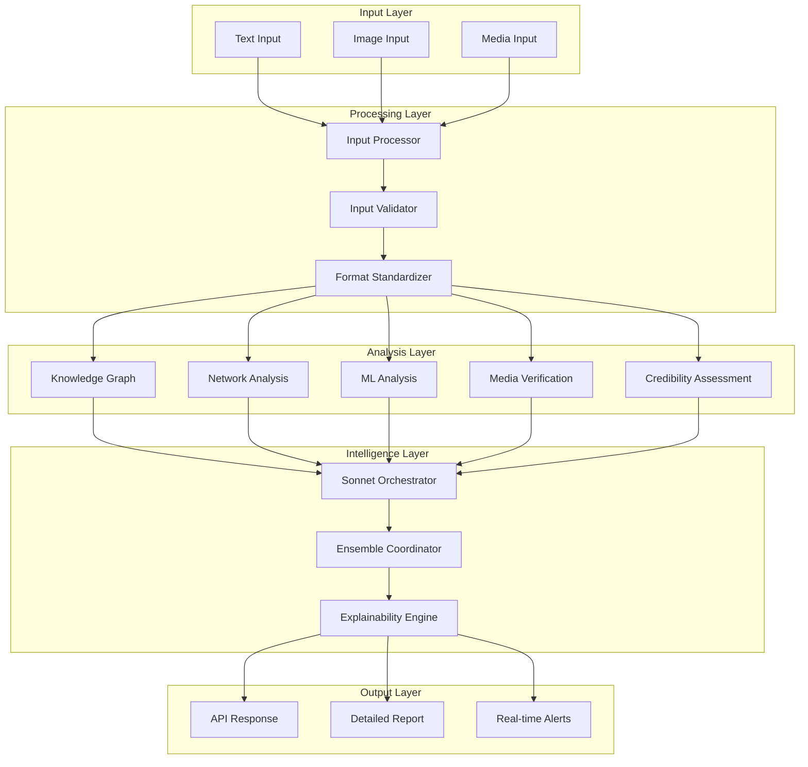

# 🔍 False News Detection System - Production Architecture

## 📋 Overview

A production-grade, modular false news detection system integrating multimodal analysis, evidence-based fact-checking, network propagation analysis, and AI-powered verification with explainable results.

## 🏗️ System Architecture

### Core Design Principles
- **Modular Architecture**: Independent, testable components
- **Microservice-Ready**: Scalable, containerized modules
- **Security-First**: End-to-end security and validation
- **Observable**: Comprehensive monitoring and tracing
- **Explainable**: Clear reasoning and evidence for decisions
- **Production-Grade**: High availability, fault tolerance, caching

### Integration Strategy
The system integrates with the existing GoodBooksRecommender infrastructure:
- Leverages existing authentication/authorization (OAuth2/JWT)
- Uses established monitoring and logging infrastructure
- Shares Redis caching layer and database connections
- Follows the same security middleware patterns
- Maintains consistency with existing API patterns

## 🧩 Module Architecture

### 1. Input Processing Module (`src/fakenews/input/`)
**Purpose**: Multimodal input handling and standardization

**Components**:
- `text_processor.py` - Text input sanitization and preprocessing
- `image_processor.py` - Image upload and metadata extraction
- `media_processor.py` - Video/audio metadata and ASR transcription
- `input_validator.py` - Cross-format validation and security checks
- `format_standardizer.py` - Convert inputs to unified format

**Key Features**:
- Support for text, images, video/audio files
- Automatic Speech Recognition (ASR) integration
- Metadata extraction and validation
- Input sanitization and security scanning
- Rate limiting for large file uploads

### 2. Knowledge Graph & Timeline Module (`src/fakenews/knowledge/`)
**Purpose**: Fact verification against structured knowledge and temporal reasoning

**Components**:
- `knowledge_graph.py` - Neo4j/NetworkX graph operations
- `fact_checker.py` - External knowledge source integration
- `timeline_verifier.py` - Temporal consistency checking
- `entity_extractor.py` - Named entity recognition and linking
- `external_apis.py` - Integration with fact-checking APIs

**Key Features**:
- Real-time fact verification against multiple sources
- Timeline consistency analysis
- Entity relationship mapping
- Historical event verification
- Confidence scoring for fact claims

### 3. Network Analysis Module (`src/fakenews/network/`)
**Purpose**: Social network propagation and anomaly detection

**Components**:
- `propagation_analyzer.py` - Content spread pattern analysis
- `diffusion_network.py` - Network topology modeling
- `anomaly_detector.py` - Suspicious pattern identification
- `bot_detector.py` - Automated account identification
- `influence_tracker.py` - Key influencer and source tracking

**Key Features**:
- Real-time propagation tracking
- Bot network detection
- Viral content pattern analysis
- Influence mapping
- Coordinated behavior detection

### 4. ML & Linguistic Analysis Module (`src/fakenews/ml/`)
**Purpose**: Advanced AI models for content analysis

**Components**:
- `gpt4_analyzer.py` - Fine-tuned GPT-4 integration
- `ensemble_models.py` - Traditional ML model ensemble
- `transformer_features.py` - BERT/RoBERTa feature extraction
- `linguistic_analyzer.py` - Style and pattern analysis
- `sentiment_analyzer.py` - Emotional manipulation detection

**Key Features**:
- Multi-model ensemble predictions
- Linguistic style analysis
- Emotional manipulation detection
- Context-aware classification
- Confidence calibration

### 5. Media Verification Module (`src/fakenews/media/`)
**Purpose**: Deepfake and media authenticity verification

**Components**:
- `deepfake_detector.py` - GAN artifact detection
- `metadata_verifier.py` - EXIF and technical metadata analysis
- `reverse_search.py` - Reverse image search integration
- `authenticity_checker.py` - Digital signature verification
- `forensics_analyzer.py` - Digital forensics techniques

**Key Features**:
- Real-time deepfake detection
- Metadata forensics
- Reverse image search
- Digital signature verification
- Tampering detection

### 6. Credibility Assessment Module (`src/fakenews/credibility/`)
**Purpose**: Source reliability and historical accuracy tracking

**Components**:
- `source_scorer.py` - Domain and source reliability scoring
- `bias_detector.py` - Political and ideological bias analysis
- `history_tracker.py` - Historical accuracy tracking
- `reputation_manager.py` - Dynamic reputation scoring
- `peer_validator.py` - Cross-source validation

**Key Features**:
- Dynamic source reputation scoring
- Bias detection and quantification
- Historical accuracy tracking
- Peer validation networks
- Trust network analysis

### 7. Explainability Module (`src/fakenews/explainability/`)
**Purpose**: Human-interpretable explanations and evidence compilation

**Components**:
- `explanation_generator.py` - Natural language explanation generation
- `evidence_compiler.py` - Supporting evidence aggregation
- `visualization_engine.py` - Interactive explanation visualizations
- `confidence_calibrator.py` - Uncertainty quantification
- `report_generator.py` - Comprehensive analysis reports

**Key Features**:
- Multi-dimensional scoring with explanations
- Interactive evidence presentation
- Confidence intervals and uncertainty
- Layered explanation depth
- Visual evidence presentation

### 8. Orchestration Module (`src/fakenews/orchestration/`)
**Purpose**: Self-refinement and ensemble coordination using Claude Sonnet

**Components**:
- `sonnet_orchestrator.py` - Claude Sonnet 4 integration for self-refinement
- `ensemble_coordinator.py` - Model ensemble management
- `threshold_tuner.py` - Dynamic threshold optimization
- `feedback_processor.py` - User feedback integration
- `model_updater.py` - Continuous learning and model updates

**Key Features**:
- Iterative self-refinement using Claude Sonnet 4
- Dynamic threshold optimization
- Ensemble weight optimization
- Continuous learning from feedback
- Model performance monitoring

### 9. API Module (`src/fakenews/api/`)
**Purpose**: RESTful and real-time API interfaces

**Components**:
- `detection_endpoints.py` - Core detection API endpoints
- `batch_processor.py` - Bulk analysis endpoints
- `websocket_handler.py` - Real-time analysis streaming
- `webhook_manager.py` - External integration webhooks
- `admin_endpoints.py` - Administrative and monitoring endpoints

**Key Features**:
- RESTful JSON API with OpenAPI documentation
- Real-time WebSocket streaming
- Batch processing capabilities
- Webhook integration
- Administrative interfaces

## 🔄 Data Flow Architecture



## 📊 Core Data Models

### Detection Request Model
```python
class DetectionRequest(BaseModel):
    text_content: Optional[str] = None
    image_urls: Optional[List[str]] = None
    media_files: Optional[List[str]] = None
    source_url: Optional[str] = None
    author_info: Optional[Dict[str, Any]] = None
    context: Optional[Dict[str, Any]] = None
    analysis_depth: AnalysisDepth = AnalysisDepth.STANDARD
    require_explanation: bool = True
```

### Detection Response Model
```python
class DetectionResponse(BaseModel):
    request_id: str
    verdict: Verdict  # AUTHENTIC, MISLEADING, FALSE, UNCERTAIN
    confidence_score: float  # 0.0 to 1.0
    risk_score: float  # 0.0 to 1.0
    
    # Multi-dimensional scores
    content_authenticity: float
    source_credibility: float
    network_anomaly_score: float
    media_authenticity: float
    
    # Evidence and explanations
    evidence: List[Evidence]
    explanation: Explanation
    supporting_facts: List[Fact]
    contradicting_facts: List[Fact]
    
    # Metadata
    analysis_duration_ms: int
    models_used: List[str]
    confidence_intervals: Dict[str, ConfidenceInterval]
    
    # Real-time updates
    status: AnalysisStatus
    progress: Optional[float] = None
```

## 🛠️ Technology Stack

### Core Technologies
- **Framework**: FastAPI with async/await
- **Database**: PostgreSQL (primary), Neo4j (knowledge graph)
- **Cache**: Redis Cluster
- **Message Queue**: Redis Streams / Apache Kafka
- **ML Framework**: PyTorch, Transformers, scikit-learn
- **Monitoring**: Prometheus + Grafana
- **Logging**: Structured logging with OpenTelemetry

### AI/ML Components
- **Language Models**: OpenAI GPT-4, Claude Sonnet 4
- **Transformers**: BERT, RoBERTa, DistilBERT
- **Computer Vision**: CLIP, ResNet, EfficientNet
- **Knowledge Graphs**: Neo4j, NetworkX, spaCy
- **Traditional ML**: XGBoost, Random Forest, SVM

### External Integrations
- **Fact-checking APIs**: Snopes, FactCheck.org, PolitiFact
- **Reverse Image Search**: Google Vision API, TinEye
- **Social Media APIs**: Twitter API, Facebook Graph API
- **News APIs**: NewsAPI, AllSides, Ground News
- **ASR Services**: Google Speech-to-Text, Whisper

## 🚀 Development Roadmap

### Phase 1: Foundation (Week 1-2)
1. **Core Infrastructure Setup**
   - Database models and migrations
   - Settings and configuration management
   - Basic API structure
   - Authentication integration
   - Monitoring setup

2. **Input Processing Module**
   - Text input handling
   - Basic input validation
   - Format standardization
   - Security scanning

### Phase 2: Knowledge & Analysis (Week 3-4)
1. **Knowledge Graph Module**
   - Neo4j integration
   - Entity extraction
   - Basic fact-checking
   - Timeline verification

2. **ML Analysis Module**
   - Text classification models
   - Ensemble framework
   - Confidence calibration
   - Performance optimization

### Phase 3: Media & Network Analysis (Week 5-6)
1. **Media Verification Module**
   - Image processing
   - Metadata extraction
   - Basic deepfake detection
   - Reverse image search

2. **Network Analysis Module**
   - Propagation tracking
   - Anomaly detection
   - Bot identification
   - Influence mapping

### Phase 4: Advanced Intelligence (Week 7-8)
1. **Credibility Assessment Module**
   - Source scoring
   - Bias detection
   - Historical tracking
   - Reputation management

2. **Orchestration Module**
   - Claude Sonnet integration
   - Ensemble coordination
   - Self-refinement logic
   - Threshold optimization

### Phase 5: Explainability & API (Week 9-10)
1. **Explainability Module**
   - Explanation generation
   - Evidence compilation
   - Visualization engine
   - Report generation

2. **Complete API Implementation**
   - All endpoint implementations
   - WebSocket real-time updates
   - Batch processing
   - Admin interfaces

### Phase 6: Production Hardening (Week 11-12)
1. **Performance Optimization**
   - Caching strategies
   - Database optimization
   - Model optimization
   - Load testing

2. **Security & Compliance**
   - Security audit
   - Input validation hardening
   - Rate limiting refinement
   - Privacy compliance

## 📈 Performance & Scalability

### Performance Targets
- **Response Time**: < 2s for standard analysis, < 30s for deep analysis
- **Throughput**: 1000+ requests/minute per instance
- **Availability**: 99.9% uptime
- **Accuracy**: > 85% precision/recall on validation datasets

### Scaling Strategy
- **Horizontal Scaling**: Stateless services with load balancing
- **Caching**: Multi-level caching (Redis, CDN, application)
- **Async Processing**: Background task queues for heavy analysis
- **Model Optimization**: Model quantization and caching
- **Database Optimization**: Read replicas, connection pooling

## 🔒 Security Considerations

### Data Security
- End-to-end encryption for sensitive data
- Input sanitization and validation
- SQL injection prevention
- XSS protection
- Rate limiting and DDoS protection

### AI Security
- Model inference security
- Prompt injection prevention
- Output sanitization
- Model versioning and rollback
- Adversarial attack protection

### Privacy
- Data minimization principles
- Anonymization for analytics
- GDPR compliance
- User consent management
- Data retention policies

## 📊 Monitoring & Observability

### Metrics
- **Performance**: Response times, throughput, error rates
- **Accuracy**: Model performance, false positive/negative rates
- **Business**: Detection rates by category, user engagement
- **Infrastructure**: CPU, memory, disk usage

### Alerting
- Model performance degradation
- High error rates
- Security incidents
- Infrastructure issues
- Data quality problems

### Logging
- Structured logging with correlation IDs
- Request/response logging
- Model decision logging
- Security event logging
- Performance profiling

---

**Next Step**: Create detailed module specifications and development tasks for each component.
