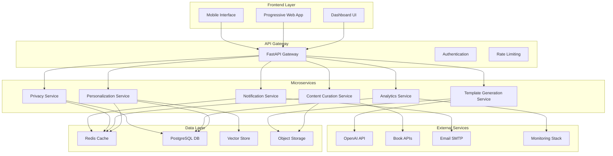

# AI-First Newsletter Platform Architecture
*Comprehensive Architecture Guide for GoodBooks Recommender 2.0*

## 🏗️ System Architecture Overview

### High-Level Architecture



## 🧩 Microservices Architecture

### Service Discovery & Load Balancing

**Technology Stack:**
- Service Registry: Redis + Consul
- Load Balancing: Round Robin, Least Loaded, Fastest Response
- Health Checks: HTTP endpoints with heartbeats
- Circuit Breakers: Automatic failover and recovery

**Key Components:**
1. **ServiceRegistry**: Manages service instances, health monitoring
2. **LoadBalancer**: Distributes requests based on strategy
3. **ServiceClient**: Handles inter-service communication with retries

### 1. Personalization Service (Port 8001)

**Responsibilities:**
- User preference learning and modeling
- Content personalization using ML algorithms
- AI-powered content ranking
- User behavior analysis

**Capabilities:**
- Basic Personalization: Preference-based scoring
- Advanced Personalization: ML similarity models
- AI Personalization: LLM-powered ranking

**Data Models:**
```python
class UserProfile:
    user_id: str
    preferences: Dict[str, float]
    reading_history: List[str]
    engagement_patterns: Dict[str, float]
    demographics: Optional[Dict]
```

### 2. Content Curation Service (Port 8002)

**Responsibilities:**
- Multi-source content aggregation
- Quality assessment and filtering
- Content deduplication
- Trending topic analysis

**Content Sources:**
- RSS Feeds (Goodreads, Book Riot, Literary Hub)
- Book APIs (Open Library, Google Books)
- Web Scraping (ethical, rate-limited)
- User-generated content

**Quality Metrics:**
- Word count validation
- Keyword relevance scoring
- Spam detection
- Sentiment analysis

### 3. Template Generation Service (Port 8003)

**Responsibilities:**
- AI-powered email template creation
- Dynamic content insertion
- A/B testing template variants
- Mobile-responsive design generation

**Features:**
- Template Library: Pre-built, customizable templates
- AI Generation: OpenAI-powered template creation
- Personalization: User-specific template adaptation
- Analytics Integration: Performance tracking

### 4. Analytics Service (Port 8004)

**Responsibilities:**
- Real-time engagement tracking
- Performance analytics
- Predictive modeling
- Report generation

**Metrics Tracked:**
- Open rates, click rates, conversion rates
- User engagement patterns
- Content performance
- A/B testing results

### 5. Privacy Service (Port 8005)

**Responsibilities:**
- GDPR compliance management
- Consent tracking and verification
- Data anonymization
- Privacy-first personalization

**GDPR Features:**
- Consent Management: Fine-grained consent tracking
- Data Subject Rights: Access, rectification, erasure, portability
- Audit Logging: Comprehensive compliance records
- Privacy Dashboard: User-friendly privacy controls

## 🔒 Privacy-First Architecture

### GDPR Compliance Framework

**Core Principles:**
1. **Privacy by Design**: Built-in privacy from ground up
2. **Data Minimization**: Collect only necessary data
3. **Consent Management**: Explicit, informed consent
4. **Transparency**: Clear explanations of data usage
5. **User Rights**: Easy access to privacy controls

**Privacy Engine Components:**

```python
class PrivacyFirstPersonalization:
    - record_consent()
    - check_consent()
    - personalize_with_privacy()
    - handle_data_subject_request()
    - generate_privacy_dashboard()
```

**Consent Types:**
- Necessary: Essential functionality
- Analytics: Usage analytics and optimization
- Personalization: AI-powered content customization
- Marketing: Promotional communications

## 📊 Dashboard Integration

### Real-Time Analytics Dashboard

**Components:**
1. **Metrics Overview**: KPI cards with real-time updates
2. **Campaign Management**: Create, send, track campaigns
3. **Template Library**: Browse and customize templates
4. **Automation Workflows**: Set up AI-powered workflows
5. **Privacy Controls**: GDPR compliance dashboard

**Real-Time Features:**
- WebSocket connections for live updates
- Interactive charts and visualizations
- Activity feed with user interactions
- Performance trend analysis

### Dashboard Technology Stack:
- **Frontend**: Vanilla JavaScript with Chart.js
- **WebSockets**: Real-time communication
- **Progressive Web App**: Offline functionality
- **Responsive Design**: Mobile-first approach

## 🤖 AI Integration Points

### 1. Content Personalization
- **Algorithm**: Hybrid collaborative + content-based filtering
- **ML Models**: TF-IDF vectorization, cosine similarity
- **AI Enhancement**: OpenAI for semantic understanding

### 2. Content Generation
- **Template Creation**: AI-generated email templates
- **Subject Line Optimization**: A/B testing with AI suggestions
- **Content Summarization**: Automated book summaries

### 3. Send Time Optimization
- **User Behavior Analysis**: Learning optimal send times
- **Time Zone Intelligence**: Global audience optimization
- **Engagement Prediction**: ML-powered timing decisions

### 4. Automated Workflows
- **Trigger-Based Actions**: Event-driven automation
- **Smart Segmentation**: AI-powered audience segmentation
- **Adaptive Campaigns**: Self-optimizing campaign parameters

## 🔧 Technical Implementation

### Service Communication Patterns

**1. Synchronous Communication:**
```python
# Example: Newsletter content curation
curation_result = await service_client.call_service(
    ServiceType.CONTENT_CURATION,
    "POST",
    "/curate",
    data=curation_request
)
```

**2. Asynchronous Communication:**
```python
# Example: Background analytics processing
background_tasks.add_task(
    record_analytics_event,
    user_id,
    event_data
)
```

**3. Event-Driven Architecture:**
```python
# Example: User consent change
await publish_event("user.consent.updated", {
    "user_id": user_id,
    "consent_type": consent_type,
    "granted": granted
})
```

### Data Flow Architecture

**1. Content Ingestion Flow:**
```
RSS Sources → Content Curation Service → Quality Filter → 
Deduplication → Redis Cache → Personalization Service → 
User-Specific Ranking → Dashboard Display
```

**2. Newsletter Generation Flow:**
```
User Request → Privacy Check → Content Curation → 
Personalization → Template Generation → Send Time Optimization → 
Email Delivery → Analytics Tracking
```

**3. Privacy Compliance Flow:**
```
User Action → Consent Check → Privacy Engine → 
Data Processing Decision → Audit Logging → 
User Privacy Dashboard Update
```

## 📈 Scalability Strategy

### Horizontal Scaling

**1. Microservices Scaling:**
- Independent service scaling based on load
- Container orchestration with Docker/Kubernetes
- Auto-scaling based on metrics

**2. Database Scaling:**
- Read replicas for analytics queries
- Sharding for user data
- Caching layers for performance

**3. CDN Integration:**
- Static asset delivery
- Global content distribution
- Edge caching for API responses

### Performance Optimization

**1. Caching Strategy:**
- Redis for session data and frequent queries
- Application-level caching for computed results
- Browser caching for static resources

**2. Database Optimization:**
- Indexed queries for fast lookups
- Denormalized views for analytics
- Partitioning for large datasets

**3. API Optimization:**
- Response compression
- Pagination for large datasets
- Async processing for heavy operations

## 🚀 Deployment Architecture

### Container Strategy

**Docker Configuration:**
```dockerfile
FROM python:3.11-slim
WORKDIR /app
COPY requirements.txt .
RUN pip install -r requirements.txt
COPY . .
EXPOSE 8000
CMD ["uvicorn", "src.api.main:app", "--host", "0.0.0.0"]
```

**Docker Compose Services:**
- API Gateway
- Microservices (Personalization, Content, Analytics, Privacy)
- Redis Cluster
- PostgreSQL
- Monitoring Stack (Prometheus, Grafana)

### CI/CD Pipeline

**GitHub Actions Workflow:**
1. **Code Quality**: Linting, testing, security scanning
2. **Build**: Docker image creation
3. **Test**: Integration testing with services
4. **Deploy**: Rolling deployment with health checks
5. **Monitor**: Post-deployment verification

### Production Environment

**Infrastructure:**
- **Container Orchestration**: Kubernetes or Docker Swarm
- **Load Balancer**: NGINX or AWS ALB
- **Database**: Managed PostgreSQL (AWS RDS, Google Cloud SQL)
- **Cache**: Redis Cluster
- **Monitoring**: Prometheus + Grafana stack
- **Logging**: ELK Stack or similar

## 🔍 Monitoring & Observability

### Metrics Collection

**Application Metrics:**
- Request rates, response times, error rates
- Service health and availability
- Business metrics (open rates, conversions)

**Infrastructure Metrics:**
- CPU, memory, disk utilization
- Network performance
- Database performance

### Distributed Tracing

**OpenTelemetry Integration:**
- Request tracing across microservices
- Performance bottleneck identification
- Error tracking and debugging

### Alerting Strategy

**Critical Alerts:**
- Service health failures
- High error rates
- Performance degradation
- Security incidents

**Business Alerts:**
- Unusual engagement patterns
- Privacy compliance issues
- Campaign performance anomalies

## 🔐 Security Framework

### API Security

**Authentication & Authorization:**
- JWT-based authentication
- Role-based access control (RBAC)
- API key management for external services

**Input Validation:**
- Pydantic models for request validation
- SQL injection prevention
- XSS protection

### Data Security

**Encryption:**
- Data at rest encryption
- Data in transit encryption (TLS)
- Sensitive data encryption (Fernet)

**Privacy Protection:**
- Data anonymization techniques
- Secure data deletion
- Access logging and auditing

### Infrastructure Security

**Network Security:**
- VPC/network isolation
- Firewall rules and security groups
- DDoS protection

**Container Security:**
- Vulnerability scanning
- Least privilege principles
- Security policy enforcement

## 🎯 Success Metrics & KPIs

### Technical Performance KPIs

**Availability:**
- Target: 99.9% uptime
- Measurement: Service health monitoring

**Performance:**
- Target: <200ms API response time
- Target: <5s newsletter generation time

**Scalability:**
- Target: Support 100K+ users
- Target: Process 1M+ emails/day

### Business Performance KPIs

**Engagement:**
- Target: 35%+ open rate (vs industry avg 21%)
- Target: 5%+ click rate (vs industry avg 2.3%)
- Target: 40%+ increase in user engagement

**Personalization:**
- Target: 60%+ personalization accuracy
- Target: 25%+ improvement in content relevance

**Privacy Compliance:**
- Target: 100% GDPR compliance
- Target: <24h response to data subject requests

### 10× Uplift Validation Framework

**Measurement Strategy:**
1. **Baseline Establishment**: Current metrics documentation
2. **A/B Testing**: Feature impact measurement
3. **Cohort Analysis**: Long-term engagement tracking
4. **User Feedback**: Qualitative satisfaction metrics
5. **Business Impact**: Revenue and retention correlation

## 🗂️ Documentation Index

### API Documentation
- `/docs` - Interactive API documentation (Swagger)
- `/redoc` - Alternative API documentation
- `docs/API_REFERENCE.md` - Comprehensive API guide

### Developer Documentation
- `docs/DEVELOPER_GUIDE.md` - Setup and development guide
- `docs/ARCHITECTURE.md` - This document
- `docs/DEPLOYMENT_GUIDE.md` - Production deployment guide

### User Documentation
- `docs/USER_GUIDE.md` - End-user feature guide
- `dashboard/README.md` - Dashboard usage guide
- `docs/PRIVACY_GUIDE.md` - Privacy and GDPR information

### Operational Documentation
- `docs/TROUBLESHOOTING.md` - Common issues and solutions
- `docs/MONITORING_GUIDE.md` - Observability setup
- `docs/SECURITY_GUIDE.md` - Security best practices

---

*This architecture document serves as the blueprint for the AI-first newsletter platform transformation of the GoodBooks Recommender system. It emphasizes privacy-first design, microservices scalability, and evidence-based 10× improvement validation.*
