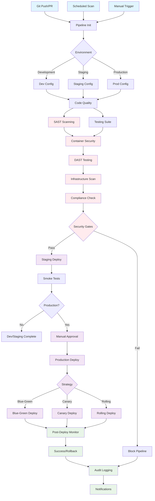
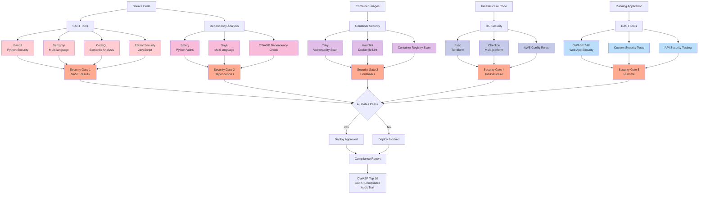
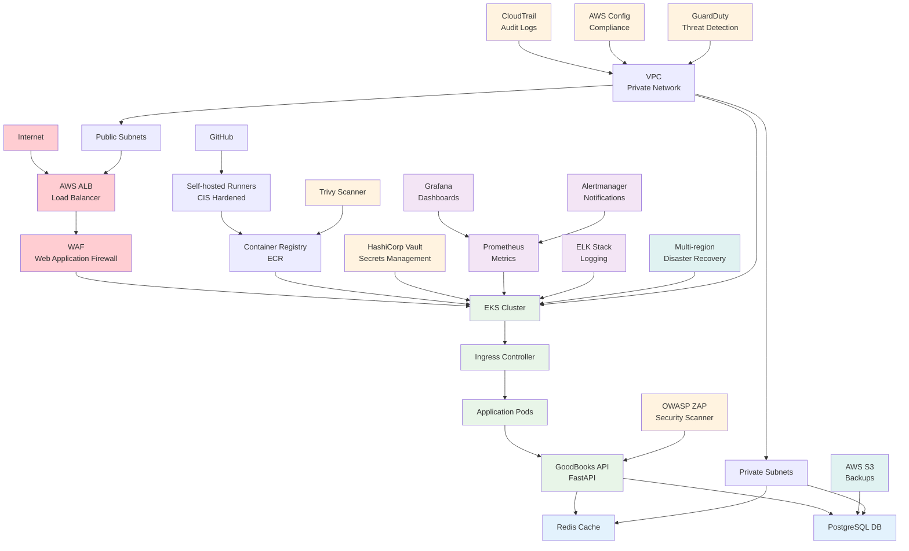
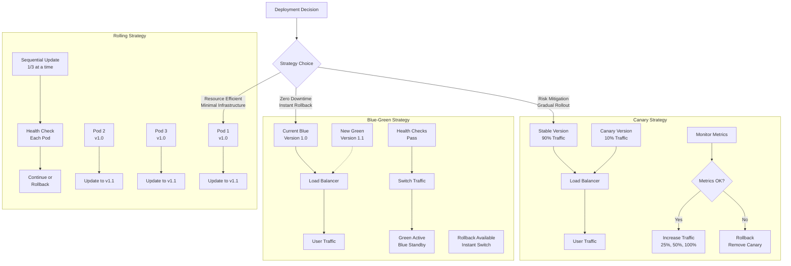

# CI/CD Pipeline Architecture

## Pipeline Flow Diagram

```mermaid
graph TB
    %% Trigger Events
    A[Git Push/PR] --> B[Pipeline Init]
    A1[Scheduled Scan] --> B
    A2[Manual Trigger] --> B
    
    %% Initialization
    B --> C{Environment}
    C -->|Development| D[Dev Config]
    C -->|Staging| E[Staging Config]
    C -->|Production| F[Prod Config]
    
    %% Parallel Quality Gates
    D --> G[Code Quality]
    E --> G
    F --> G
    G --> H[SAST Scanning]
    G --> I[Testing Suite]
    
    %% Security Scanning
    H --> J[Container Security]
    I --> J
    J --> K[DAST Testing]
    K --> L[Infrastructure Scan]
    L --> M[Compliance Check]
    
    %% Security Gates
    M --> N{Security Gates}
    N -->|Pass| O[Staging Deploy]
    N -->|Fail| P[Block Pipeline]
    
    %% Deployment Flow
    O --> Q[Smoke Tests]
    Q --> R{Production?}
    R -->|No| S[Dev/Staging Complete]
    R -->|Yes| T[Manual Approval]
    T --> U[Production Deploy]
    
    %% Deployment Strategies
    U --> V{Strategy}
    V -->|Blue-Green| W[Blue-Green Deploy]
    V -->|Canary| X[Canary Deploy]
    V -->|Rolling| Y[Rolling Deploy]
    
    %% Monitoring
    W --> Z[Post-Deploy Monitor]
    X --> Z
    Y --> Z
    Z --> AA[Success/Rollback]
    
    %% Audit and Notifications
    AA --> BB[Audit Logging]
    P --> BB
    BB --> CC[Notifications]
    
    %% Styling
    classDef trigger fill:#e1f5fe
    classDef security fill:#ffebee
    classDef deploy fill:#f3e5f5
    classDef monitor fill:#e8f5e8
    
    class A,A1,A2 trigger
    class H,J,K,L,M,N security
    class O,T,U,V,W,X,Y deploy
    class Z,AA,BB,CC monitor
```

## Security Architecture

```mermaid
graph TB
    %% Code Analysis Layer
    A[Source Code] --> B[SAST Tools]
    B --> B1[Bandit<br/>Python Security]
    B --> B2[Semgrep<br/>Multi-language]
    B --> B3[CodeQL<br/>Semantic Analysis]
    B --> B4[ESLint Security<br/>JavaScript]
    
    %% Dependency Analysis
    A --> C[Dependency Analysis]
    C --> C1[Safety<br/>Python Vulns]
    C --> C2[Snyk<br/>Multi-language]
    C --> C3[OWASP Dependency Check]
    
    %% Container Security
    D[Container Images] --> E[Container Security]
    E --> E1[Trivy<br/>Vulnerability Scan]
    E --> E2[Hadolint<br/>Dockerfile Lint]
    E --> E3[Container Registry Scan]
    
    %% Infrastructure Security
    F[Infrastructure Code] --> G[IaC Security]
    G --> G1[tfsec<br/>Terraform]
    G --> G2[Checkov<br/>Multi-platform]
    G --> G3[AWS Config Rules]
    
    %% Runtime Security
    H[Running Application] --> I[DAST Tools]
    I --> I1[OWASP ZAP<br/>Web App Security]
    I --> I2[Custom Security Tests]
    I --> I3[API Security Testing]
    
    %% Security Gates
    B1 --> J[Security Gate 1<br/>SAST Results]
    B2 --> J
    B3 --> J
    B4 --> J
    
    C1 --> K[Security Gate 2<br/>Dependencies]
    C2 --> K
    C3 --> K
    
    E1 --> L[Security Gate 3<br/>Containers]
    E2 --> L
    E3 --> L
    
    G1 --> M[Security Gate 4<br/>Infrastructure]
    G2 --> M
    G3 --> M
    
    I1 --> N[Security Gate 5<br/>Runtime]
    I2 --> N
    I3 --> N
    
    %% Final Security Decision
    J --> O{All Gates Pass?}
    K --> O
    L --> O
    M --> O
    N --> O
    
    O -->|Yes| P[Deploy Approved]
    O -->|No| Q[Deploy Blocked]
    
    %% Compliance Reporting
    P --> R[Compliance Report]
    Q --> R
    R --> S[OWASP Top 10<br/>GDPR Compliance<br/>Audit Trail]
    
    %% Styling
    classDef sast fill:#ffcdd2
    classDef deps fill:#f8bbd9
    classDef container fill:#e1bee7
    classDef iac fill:#c5cae9
    classDef dast fill:#bbdefb
    classDef gate fill:#ffab91
    
    class B1,B2,B3,B4 sast
    class C1,C2,C3 deps
    class E1,E2,E3 container
    class G1,G2,G3 iac
    class I1,I2,I3 dast
    class J,K,L,M,N gate
```

## Infrastructure Architecture

```mermaid
graph TB
    %% External Access
    A[Internet] --> B[AWS ALB<br/>Load Balancer]
    B --> C[WAF<br/>Web Application Firewall]
    
    %% Kubernetes Cluster
    C --> D[EKS Cluster]
    D --> E[Ingress Controller]
    E --> F[Application Pods]
    
    %% Application Components
    F --> G[GoodBooks API<br/>FastAPI]
    G --> H[Redis Cache]
    G --> I[PostgreSQL DB]
    
    %% CI/CD Infrastructure
    J[GitHub] --> K[Self-hosted Runners<br/>CIS Hardened]
    K --> L[Container Registry<br/>ECR]
    L --> D
    
    %% Security Infrastructure
    M[HashiCorp Vault<br/>Secrets Management] --> D
    N[OWASP ZAP<br/>Security Scanner] --> G
    O[Trivy Scanner] --> L
    
    %% Monitoring Infrastructure
    P[Prometheus<br/>Metrics] --> D
    Q[Grafana<br/>Dashboards] --> P
    R[Alertmanager<br/>Notifications] --> P
    S[ELK Stack<br/>Logging] --> D
    
    %% Backup and DR
    T[AWS S3<br/>Backups] --> I
    U[Multi-region<br/>Disaster Recovery] --> D
    
    %% Network Security
    V[VPC<br/>Private Network] --> D
    V --> W[Private Subnets]
    V --> X[Public Subnets]
    W --> I
    W --> H
    X --> B
    
    %% Compliance and Audit
    Y[CloudTrail<br/>Audit Logs] --> V
    Z[AWS Config<br/>Compliance] --> V
    AA[GuardDuty<br/>Threat Detection] --> V
    
    %% Styling
    classDef external fill:#ffcdd2
    classDef k8s fill:#e8f5e8
    classDef app fill:#e3f2fd
    classDef security fill:#fff3e0
    classDef monitoring fill:#f3e5f5
    classDef storage fill:#e0f2f1
    
    class A,B,C external
    class D,E,F,G k8s
    class H,I app
    class M,N,O,Y,Z,AA security
    class P,Q,R,S monitoring
    class T,U storage
```

## Deployment Strategies

```mermaid
graph TB
    %% Blue-Green Deployment
    subgraph "Blue-Green Strategy"
        A[Current Blue<br/>Version 1.0] --> B[Load Balancer]
        C[New Green<br/>Version 1.1] -.-> B
        B --> D[User Traffic]
        
        E[Health Checks<br/>Pass] --> F[Switch Traffic]
        F --> G[Green Active<br/>Blue Standby]
        H[Rollback Available<br/>Instant Switch]
    end
    
    %% Canary Deployment
    subgraph "Canary Strategy"
        I[Stable Version<br/>90% Traffic] --> J[Load Balancer]
        K[Canary Version<br/>10% Traffic] --> J
        J --> L[User Traffic]
        
        M[Monitor Metrics] --> N{Metrics OK?}
        N -->|Yes| O[Increase Traffic<br/>25%, 50%, 100%]
        N -->|No| P[Rollback<br/>Remove Canary]
    end
    
    %% Rolling Deployment
    subgraph "Rolling Strategy"
        Q[Pod 1<br/>v1.0] --> R[Update to v1.1]
        S[Pod 2<br/>v1.0] --> T[Update to v1.1]
        U[Pod 3<br/>v1.0] --> V[Update to v1.1]
        
        W[Sequential Update<br/>1/3 at a time] --> X[Health Check<br/>Each Pod]
        X --> Y[Continue or<br/>Rollback]
    end
    
    %% Decision Matrix
    Z[Deployment Decision] --> AA{Strategy Choice}
    AA -->|Zero Downtime<br/>Instant Rollback| A
    AA -->|Risk Mitigation<br/>Gradual Rollout| I
    AA -->|Resource Efficient<br/>Minimal Infrastructure| Q
```

## Security Gates Flow

```mermaid
graph LR
    %% Stage 1: Code Quality
    A[Code Commit] --> B[Code Quality Gate]
    B --> B1{Linting Pass?}
    B1 -->|No| B2[Block: Fix Code Quality]
    B1 -->|Yes| C[SAST Gate]
    
    %% Stage 2: SAST
    C --> C1{SAST Clean?}
    C1 -->|No| C2[Block: Fix Vulnerabilities]
    C1 -->|Yes| D[Testing Gate]
    
    %% Stage 3: Testing
    D --> D1{Tests Pass?}
    D1 -->|No| D2[Block: Fix Tests]
    D1 -->|Yes| E[Container Gate]
    
    %% Stage 4: Container Security
    E --> E1{Container Secure?}
    E1 -->|No| E2[Block: Fix Container Issues]
    E1 -->|Yes| F[DAST Gate]
    
    %% Stage 5: DAST
    F --> F1{DAST Clean?}
    F1 -->|No| F2[Block: Fix Runtime Vulns]
    F1 -->|Yes| G[Compliance Gate]
    
    %% Stage 6: Compliance
    G --> G1{Compliance Met?}
    G1 -->|No| G2[Block: Fix Compliance]
    G1 -->|Yes| H[Deploy Approved]
    
    %% Approval Flow
    H --> I{Environment}
    I -->|Development| J[Auto Deploy]
    I -->|Staging| K[Auto Deploy + Tests]
    I -->|Production| L[Manual Approval Required]
    
    L --> M[Production Deploy]
    
    %% Monitoring
    J --> N[Monitor & Alert]
    K --> N
    M --> N
    
    %% Styling
    classDef gate fill:#ffab91
    classDef block fill:#ffcdd2
    classDef deploy fill:#c8e6c9
    classDef monitor fill:#e1bee7
    
    class B,C,D,E,F,G gate
    class B2,C2,D2,E2,F2,G2 block
    class H,J,K,M deploy
    class N monitor
```
